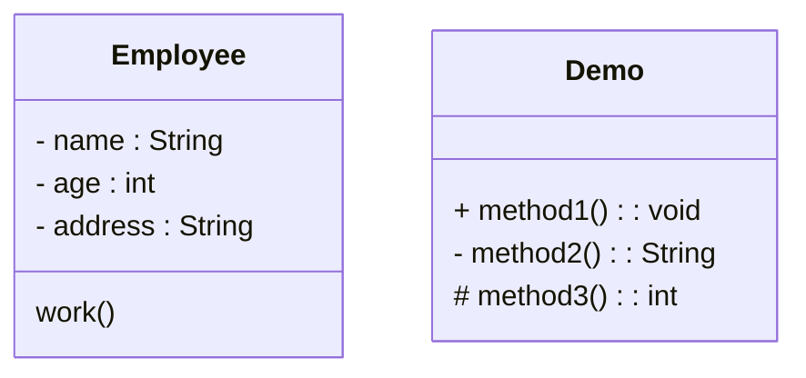

## 专业技能

| 点       | 内容                                                      |
| -------- | --------------------------------------------------------- |
| 调研分析 | 商业、行业、市场、**用户、竞品、需求**                    |
| 决策判断 | 可行性、**优先级**、机会、成本、技术、风险                |
| 规划定义 | 业务、架构、**流程、结构、功能、逻辑**                    |
| 体验设计 | **用户体验、产品体验、原型设计**、交互设计                |
| 文档工具 | BRD、MRD、PRD、立项说明书、产品说明书、协作工具、设计工具 |

## 常用工具

| 常用工具   | 列表                  |
| ---------- | --------------------- |
| 原型工具   | AxureRP、墨刀、Sketch |
| 脑图工具   | XMind                 |
| 流程图工具 | Visio                 |
| 团队协作   | 禅道                  |
| Office套件 | Word、Excel、PPT      |

## 产品开发流程

分析定义（问题定义、可行性研究、需求分析）、软件设计（概要设计、详细设计）、编码测试、运行维护

## 绘图介绍

#### 

UML 统一建模语言，适用于设计软件的可视化建模语言。他的特点是简单、同意、图形化、能表达软件设计中的动态与静态信息。UML从目标系统的不同角度出发，定义了用例图、类图、对象图、状态图、活动图、时序图、协作图、构件图、部署图等九种图。

### 流程图

#### 介绍与绘制

流程图是为了达到特定目的而进行的一系列有逻辑性的操作步骤，由两个及以上的步骤，完成一个完整的行为的过程，可称之为流程，流程图则是将这个过程进行图形化展示。

业务流程图：通过一种特定的符号和连线来表示具体某个业务的实际处理步骤和过程，详细的描述任务的流程走向

功能流程图：通过图形化的表达方式，阐述产品在功能层面控制的图表

页面流程图：指产品具体所呈现的页面跳转流程图，其承载了业务流程图所包含的业务流换信息

##### 案例

作为一家电商平台，常见的流程会类似于是这样的:

1. 买家去某个平台下单，确认自己的订单信息没有问题之后，便把订单提交了
2. 接下来，用户根据自己的情况选择使用不同的方式付款，付款之后，就会变成一个待发货状态的订单;但也会存在各种原因导致用户放弃付款，此时返回就能看到一个待付款的订单
3. 用户付款成功后，就轮到卖家根据付款成功的订单去准备发货了，货发出去之后，为了让用户看到物流信息，卖家还会去填写物流的相关信息，填写完成之后，用户便能看到商品已发货
4. 用户收到货以后，点击确认收货，这笔订单就完成了

#### 绘制注意事项

1. 应遵循从左往右，从上到下的顺序排列
2. 从开始符开始，以结束符结束，值得注意的是，开始符只能出现一次，而结束符号可以出现多次；若流程足够清晰，可以省略开始、结束符号
3. 需要认真检查各个步骤或者判定结果，避免出现漏洞，导致流程无法形成闭环
4. 连接线尽量避免交叉
5. 必要时可以采用标注，以便更加清晰地说明流程
6. 流程图中，如果有参考其他已经定义的流程，不需重新绘制，直接用已定义的子流程符号即可

#### 常用元素与结构

| 元素样式 | 元素名称    | 元素介绍                                                     |
| -------- | ----------- | ------------------------------------------------------------ |
| 胶囊形   | 开始 / 结束 | 流程图的开始和结束都以此元素样式为准                         |
| 矩形     | 节点        | 任何一个操作或者状态，都为一个节点                           |
| 菱形     | 判定        | 遇到不同处理结果的情况下，采用此符号链接分支流程             |
| 橡皮擦？ | 子流程      | 将流程中一部分有逻辑关系的节点集合成一个子流程，方柏霓主流程序频繁调用 |
| 箭头     | 连接线      | 用来将任意节点连接起来，连线上可以添加文字                   |

- 顺序结构：根据流程图的步骤，从上到下，从左到右，依次执行
- 选择结构：二选一
- 多元选择结构：多选一
- 循环结构：循环执行

 ### 泳道图

泳道图也叫做（跨职能）流程图，旨在展示工作流中每个步骤设计的流程和职能部门（多角色）。

### 结构图

#### 结构图的分类

功能结构图：简单的讲就是结构化来界定这个产品有什么功能，可以用来做什么

信息结构图：将产品的信息数据梳理出来，组成的结构图

产品结构图：将产品的初始原型以结构化的方式展示出来

### 活动图

用来执行算法的工作流程中涉及的活动，活动状态代表了一个活动：一个工作流步骤或一个操作的执行。活动图描述了一组顺序的或并发的活动

#### 基本元素

| 元素                   | 说明           | 备注                                                         |
| ---------------------- | -------------- | ------------------------------------------------------------ |
| 实心圆                 | 初始节点       |                                                              |
| 一个圆圈内加一个实心圆 | 活动终点       |                                                              |
| 四角圆弧               | 活动节点       |                                                              |
| 带箭头的直线           | 转换           | 当一个活动结束后，控制流就会传递给下一个活动节点，活动图中被称为转换 |
| 菱形                   | 分支与监护条件 | 每个离开转换上都会有一个监护条件                             |
|                        | 分叉与会合     |                                                              |
|                        | 泳道           |                                                              |

### 用例图

### 类图 UML Class Diagram

#### 类图概述

显示了模型的静态结构，特别是模型中存在的类、类的内部结构以及他们与其他类的关系等。类图是面向对象建模的主要组成部分，简化了人们对系统的理解。类图是系统分析和设计阶段的重要产物。是系统编码和测试的重要模型

#### 类的表示

##### 普通类

在UML类图，类使用包含类名、属性和方法且带有分割线的矩形来表示。比如下图表示一个Employee类，他包含name,age和address三个属性，以及work()方法。

属性的完整表示方式是： 可见性  名称  ： 类型 [ =缺省值]

方法的完整表示方式是：可见性  名称(参数列表)[：返回类型]

访问权限：

| 符号 | 说明           |
| ---- | -------------- |
| +    | 表示 public    |
| -    | 表示 private   |
| #    | 表示 protected |

##### 抽象类

在UML类图中，抽象类**类名名称用斜体**表示，抽象方法用斜体表示。<u>类图边框用虚线表示</u>（建议）

##### 接口

接口名称用斜体表示，抽象方法用斜体表示

接口取消属性栏（建议）

#### 类与类关系表示

### 时序图

### E-R图

## Visio 快捷键

| 快捷键                | 功能     |
| --------------------- | -------- |
| Ctrl + Alt + 鼠标右键 | 拖动视图 |
| Ctrl + 1              | 指针工具 |
| Ctrl + D              | 复制粘贴 |
| Ctrl + 鼠标左键       | 多选     |

