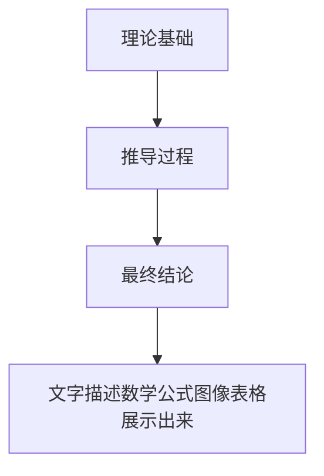

#  数学建模

## 数建竞赛

### 上半年

```js
# 1. 美国大学生数学建模竞赛(★★★★★)
主办方: 美国数学及其应用联合会
报名费: 100美元，一般由学校组织报名
竞赛时间:寒假期间，春节前后
获奖比例:O奖(特等奖)<1%，F奖(特等奖提名)<1%·M奖(一等奖)6%，H奖(二等奖)26%S奖(成功参赛):65%
该比赛需提交全英文论文

# 2. Mathorcup高校数学建模挑战赛(★★★★★)
主办方:中国优选法统筹法与经济数学研究会
报名费: 200元
竞赛时间: 4月中旬
获奖比例: 一等奖约5%，二等奖约15%，三等奖约30%成功参赛奖若干，成功提交论文的队伍均可获得证书

# 3. 华中杯大学生数学建模挑战赛(★★★★)
主办方:湖北省工业与应用数学学会
报名费: 150元
竞赛时间: 4月下旬左右
获奖比例: 一等奖不超过报名队数的2%二等奖不超过报名队数的10%三等奖不超过报名队数的25%


# 4. 认证杯数学建模网络挑战赛(★★★)
主办方: 内蒙古自治区数学学会
报名费: 100元
竞赛时间: 4月下旬左右
获奖比例: 一等奖不超过5%，二等奖不超过15% 三等奖不超过25%
    
# 5. 华东杯大学生数学建模邀请赛(★★★)
主办方: 复旦大学数学科学学院
报名费: 免费
竞赛时间: 4月底、5月初左右获奖比例:
根据比赛评审情况: 设特等奖、一等奖、二等奖、三等奖、成功参赛奖若干

# 6. 五一数学建模竞赛(★★★★)
主办方: 江苏省工 业与应用数学学会
报名费: 100元
竞赛时间: 每年五月一日
获奖比例: 一等奖不超过5%，二等奖不超过15%
三等奖不超过25%
    
# 7. 中青杯全国大学生数学建模竞赛(★★★)
主办方: 吉林省科技教育学会
报名费: 100元
竞赛时间: 5月中下旬左右
获奖比例: 特等奖3支队伍，一等奖不超过3%，二等奖不超过15%三等奖不超过25%，优秀奖若干

# 8. 全国大学生电工数学建模竞赛(★★★★★)
主办方:中国电机工程学会
报名费:免费
竞赛时间:5月中下旬左右
获奖比例:评选一、二、三等奖，获奖比例一般不超过参赛队数的二分之一

# 9. 数维杯大学生数学建模竞赛(★★★)
主办方: 内蒙古创新教育学会
报名费:100元
竞赛时间: 上半年5月下旬，下半年11月下旬
获奖比例: 特等奖3个，一等奖5%，二等奖15% 三等奖30%
    
    
# 10. 全国大学生统计建模大赛:(★★★)
主办方: 中国统计教育学会
报名费: 免费
竞赛时间: 竞赛时间两个月，三月报名
获奖比例: 省赛:省赛评选出优秀论文入围全国赛其余参赛论文设省赛一、二、三等奖省级获奖比例分别为10%、20%和30%入围全国赛的论文同时获省赛一等奖不占省赛名额，入围全国赛的论文评选一、二、三等奖国奖比例为10%、20%、70%

```


### 下半年

```js
# 11. 华数杯全国大学生数学建模竞赛(★★★)
主办方: 中国未来研究会大数据与数学模型专业委员会
报名费: 200元
竞赛时间: 8月上旬左右
获奖比例: 一等奖不超过10%，二等奖不超过20%三等奖不超过30%

# 12. 高教社杯全国大学生数学建模竞赛(★★★★★★)
主办方:中国工业与应用数学学会
报名费:300元
竞赛时间:9月中旬左右
获奖比例:在各赛区内部评选优秀论文至国奖评出全国一等、二等奖，获奖比例为百分之十左右
各地区省奖获奖比例不固定分为省一，省一和省三，省奖综合获奖率30%左右

# 13. 华为杯研究生数学建模竞赛(★★★★)
主办方:教育部学位与研究生教育发展中心
报名费:300元
竞赛时间:9月中下旬左右
获奖比例:三等奖获奖队数不超过1.5%、13%、20%等奖每道赛题排名前两名队伍参加“数模之星”决赛答辩会

# 14.大湾区杯粤港澳金融数学建模竞赛(★★★)
主办方:广东省工业与应用数学学会
报名费:200元
竞赛时间:11月上旬左右
获奖比例:
金奖1名，奖金20000元，银奖3名，奖金6000元
铜奖6名，奖金3000元
等奖、二等奖、三等奖及优胜奖若干名

# 15. 数学中国数学建模国际赛(★★★)
主办方:蒙古自治区数学学会
报名费:200元
竞赛时间:11月下旬左右
获奖比例:特等奖3%，特等奖提名奖5%-等奖10%，二等奖30%

# 16. 亚太地区大学生数学建模竞赛(★★★)
主办方:北京图象图形学学会
报名费:100元
竞赛时间:11月下旬左右
获奖比例
-等奖5%，二等奖15%
三等奖25%，优秀奖:55%

```


### 高脚杯（国赛）

赛题：本科组ABC任选一道；专科组D和E，可选ABC

A题偏向物理/工程类

专业性较强，往往有标准答案，非本专业不建议选择
需要根据物理定理使用微分方程和偏微分方程模型
神经网络/遗传算法等求解较优解的启发式算法一般不适用!!!热力学等物理题可以先建立一个非常简陋的模型，再根据题目中的要求，一点一点改进

B题由于近两年改革，题型不定，19年物理类，20年运筹优化类

C题偏向经管/运筹/统计/数据分析类
赛题较开放易读懂
运筹优化类问题一般没有严格最优解，结果合理即可
数据往往需要自己找


### 搜索技巧

```js
# 完全匹配搜索:查询词的外边加上双引号引号中英文均可
例如搜索 “CT参数标定”，得到的结果不是分别带有“CT”或“参数标定”的网页

# 标题必含关键词:查询词前加上intitle:
冒号为英文输入下的
例如搜索 intitle:CT参数标定，则搜索结果里每一个标题都会带有“CT参数标定

# 搜索文档:例如查询词后空格再输入fietype:文件格式(doc/pdf/xls/等等)
例如搜索:线性规划filetype:pdf
得到的就都是pdf版的资料

# 去掉不想要的:查询词后面加空格后加减号与关键字
例如搜索后不想看百度文库的东西，搜索线性规划filetype:pdf
-百度文库
```


### 查文献

#### 知网

```js
# 先看知网的硕博士论文
- 硕博论文会对研究的问题有详细的背景和基础知识介绍，可帮助我们快速理解题目。
- 按照“被引”排序

# 高级检索:想了解神经网络在信贷策略中的应用，想找一些相关的硕博论文“+”和“-”可以自定义增加和减少检索字段
1. 进入高级检索界面
2. 主题为:企业信贷
3. OR 主题为:信贷决策
4. AND 关键词:神经网络，词频设置为“模糊”。模糊”是输入的检索词在检索结果中出现即可，字序、字间间隔可以产生变化。
5. 检索结果可按“相关度”或“被引”排序5
```


#### 其他

```js
# 谷歌学术镜像
国内不能访问谷歌学术，而镜像对一个网站内容的拷贝
http://scholar. hedasudi.com/

# Open Access Library
文章都来自顶级著名的出版商和数据库，可以满足各个领域学者的需求
所有文章免费下载
https://www.oalib.com/

# 对于数模国赛，没必要查外文文献
```


### 数据源


```js
# 优先在知网、谷歌学术等平台搜索

# 国家统计局
- 最全面，月度季度年度，各地区各部门各行业，包罗万象
- https://data.stats.gov.cn/
- 国家部门网站大多都有数据分页，如果需要可另行查找

# awesome-public-datasets
- GitHub上的一个项目，包含了经济、地理、能源、教育等所有你能想到的领域的数据
- https://github.com/awesomedata/awesome-public-datasets
- (如果网页打不开，可尝试用登外网的方法)

# EPSDATA平台
- EPSDATA平台有丰富的数据资源和大量分析处理过的数据结果，是收费的，不过可以申请7天的试用。https://www.epsnet.com.cn/

# 其他:国家信息中心，kaggle，和鲸社区
```


## 基本概述


- 数学建模的六个步骤
- 一、模型准备
  - 了解问题的实际背景，明确其实际意义，掌握对象的各种信息。
  - 以数学思路来解释问题的精髓，数学思路贯穿问题的全过程，进而用数学语言来描述问题。
  - 要求符合数学理论，符合数学习惯，清晰准确。理解实际问题后，搜集资料，快速读和理解参考文献。
  - **大白话:找对象前先打听一下对方有没有男朋友，喜欢的男生类型，了解对方的喜好**
- 二、模型假设
  - 根据实际对象的特征和建模的目的，对问题进行必要的简化，并用精确的语言提出一些恰当的假设。
  - 对涉及到的变量、变量的单位、相关假设进行定义，用表达式将其表达出来。
  - **大白话:假设她不喜欢LV、假设她能吃辣、假设她喜欢看电影。**
- 三、模型建立
  - 在假设的基础上，利用适当的数学工具来刻划各变量常量之间的数学关系，建立相应的数学结构。
  - 选择建模方法，由题目得到的关系式，将目标转化为某一变量的函数。
  - **大白话:找对象要学会浪漫，可以根据她的喜好安排约会、请客吃饭、看电影等等**
- 四、模型求解
  - 利用获取的数据资料，对模型的所有参数做出计算(或近似计算)。
  - 推导模型的公式，将数学表达式变形为建模方法的标准形式，通过限制条件，对这个型进行求解。
  - 此时可以编程用数学软件进行计算。
  - **大白话:做了这么多要找个合适的机会向她表白，表明自己的心意，表达对她的爱**
- 五、模型分析
  - 对所要建立模型的思路进行阐述，对所得的结果进行数学上的分析。
  - 包括误差分析、数据稳定性分析等。
  - **大白话:被拒绝是很正常的事情，反思一下自己哪里做的不够好，继续改进继续努力**
- 六、模型检验
  - 用非技术性的语言回答实际问题。将模型分析结果与实际情形进行比较，以此来验证模型的准确性、合理性和适用性。
  - 如果模型与实际较吻合，则要对计算结果给出其实际含义，并进行解释。
  - 如果模型与实际吻合较差，则应该修改假设，再次重复建过程。
  - **大白话:将自己追女生的经历和朋友们做分享，听听别人的意见，看看自己是不是舔狗**


### 分工协作与对应要求

#### 建模手

需要系统掌握各类模型，做到以下几点：

- 该模型的主要功能是什么?
- 该模型的适用场景是什么?
- 实现该模型需要哪些条件?
- 模型有哪些缺点或不足？
- 可以做出那些改进?


#### 编程手

需要掌握 Matlab / Python 做到：

- 能够数量掌握编程基础
- 能够实现各类常见算法
- 能够对程序Bug做出改正
- 能够熟练利用编程或软件
- 制作精美图片


#### 论文手

需要熟练撰写论文各模块内容

- 能够掌握学术语言规范
- 明白论文各模块写作要求
- 能够对论文进行排版
- 若撰写英文论文，需要能
- 翻译并检查论文错误


| 竞赛流程   | 论文写作排版   |
| ---------- | -------------- |
| 赛前准备   | 模板设置       |
| 赛题选择   | 标题与摘要     |
| 文献和数据 | 学术用语       |
| 数据预处理 | 参考文献与附录 |
| 建模与求解 | 公式编辑       |
| 整理检查   | 图与表格       |
| 论文提交   | 换行与分页     |


### 模型与适用赛题概览

| 赛题     | 优化类         | 预测类        | 评价决策类   | NP-hard类    |
| -------- | -------------- | ------------- | ------------ | ------------ |
| 特点     | 最优最短最合适 | 短/长期和周期 | 孰优孰劣     | 无法求最优解 |
| 模型算法 | 线性规划       | 灰色预测      | 层次分析     | 蚁群算法     |
|          | 非线性规划     | 时间序列      | TOPSIS法     | 粒子群算法   |
|          | 多目标规划     | 回归分析      | 灰色关联分析 | 遗传算法     |
|          | 最短路径       | 支持向量机    | 模糊综合评价 | 模拟退火     |
|          | 最小生成树     | 神经网络预测  | 主成分分析   |              |
|          | 动态规划       | 马尔科夫链    | 聚类分析     |              |


### 数据预处理 

#### 缺失值


```js
# 比赛提供的数据，发现有些单元格是nul或空的例如调查人口信息，

# 缺失太多：例如 发现“年龄”这一项缺失了40%，就直接把该项指标删除缺失)

# 最简单处理:均值、众数插补
- 定量数据，例如关于一群人的身高、年龄等数据，用整体的均值来补缺失
- 定性数据：例如关于一群人的性别、文化程度;某些事件调查的满意度，用出现次数最多的值补缺失定性数据，
- 适用赛题:人口的数量年龄、经济产业情况等统计数据，对个体精度要求不大的数据

# Newton插值法
- 根据固定公式，构造近似函数，补上缺失值，普遍适用性强
- 缺点:区间边缘处的不稳定震荡，即龙格现象。不适合对导数有要求的题目
- 适用赛题:热力学温度、地形测量、定位等只追求函数值精准而不关心变化的数据

# 样条插值法
- 用分段光滑的曲线去插值，光滑意味着曲线不仅连续，还要有连续的曲率
- 适用赛题:零件加工，水库水流量，图像“基线漂移”，机器人轨迹等精度要求高、没有突变的数据
```


#### 异常值

```js
# 样本中明显和其他数值差异很大的数据，例如一群人的身高数据中有个3米2的正态分布3o原则

# 正态分布 3σ 原则
- 数值分布在(μ - 3σ,μ + 3σ)中的概率为99.73%，其中u为平均值，σ为标准差.
- 求解步骤:1.计算均值μ 和 标准差σ;2.判断每个数据值是否在(μ-30,μ + 3σ)内，不在则为异常值·
- 适用题目:总体符合正态分布，例如人口数据、测量误差、生产加工质量、考试成绩等
- 不适用题目:总体符合其他分布，例如公交站人数排队论符合泊松分布

# 画箱型图
- 箱型图中，把数据从小到大排序。下四分位数Q1是排25%的数值，上四分位数Q3是排第75%的数值箱型图中
- 四分位距IQR = Q3 - Q1，也就是排名第75%的减去第25%的数值上极限与正态分布类似，设置个合理区间，在区间外的就是异常值上四分位数
- 一般设[Q1 - 1.5 * IQR, Q3 +1.5*IQR]内为正常值

```


### 模型




一篇完整的数模论文，包括摘要(最重要)、问题重述、模型假设和符号说明、模型建立与求解(最长)、模型的优缺点与改进方法、参考文献和附录。

- 摘要：**最重要**。读者看完摘要，就知道论文研究的**问题**、用了什么**方法**、求得了什么**结果**，以及每一部分的**大致步骤**。
- 问题重述：将题目简述一遍即可，并不重要。注意不要复制粘贴，避免查重
- 模型假设和符号说明，好的假设能让你**事半功倍**，例如某一年太阳投影问题，影子长度与地球公转也有关系，但地球公转对影长的影响远远小于自转，可在模型假设里说明“忽略公转对影长的影响”。符号说明将论文中定义的重要符号列出表格说明即可
- 一组公式，和对公式中每个变量的解释，就是一个模型
- 先查阅资料，看着资料，用自己的话复述一个简单的模型，再根据题目中的约束条件去一步步修改模型把题目中的变量带入模型中去


参考文献

- 格式一定要规范
- 知网检索结果右侧有引用按钮，打开后复制即可

附录

- 附录里要写出正文中求解时用到的代码
- 一定不要把网上搜到的代码直接复制粘贴!!!
- 把查到的代码里变量名换一换就不会被查重
- 曾出现过参加国赛，在省内被推到国奖，但查重发现代码是复制的，结果被取消获奖并官网通报的先例


## 建模思路

以2023年高教社杯全国大学生数学建模竞赛题目E题为例

```python
# 问题1
研究该水文站黄河水的含沙量与时间、水位、水流量的关系，并估近6年该水文站的年总水流量和年总排沙量。

# 问题2
分析近6年该水文站水沙通量的突变性、季节性和周期性等特性，研究水沙通量的变化规律。

# 问题3
根据该水文站水沙通量的变化规律，预测分析该水文站术来两年水沙通量的变化趋势，并为该水文站制订未来两年最优的采样监测方案(采样监测次数和具体时间等)，使其既能及时掌握水沙通量的动态变化情况，又能最人程度地减少监测成本资源。

# 问题4
根据该水文站的水沙通量和河底高程的变化情况，分析每年6-7月小浪底水库进行“调水调沙”的实际效果。如果不进行“调水调沙”，10年以后该水文站的河底高程会如何?

# 附件1 2016-2021年黄河水沙监测数据
# 附件2 黄河断面的测量数据
# 附件3 黄河部分监测点的监测数据
```


### 问题1 研究该水文站黄河水的含沙量与时间、水位、水流量的关系，并估近6年该水文站的年总水流量和年总排沙量。


### 问题2 分析近6年该水文站水沙通量的突变性、季节性和周期性等特性，研究水沙通量的变化规律。


### 问题3 根据该水文站水沙通量的变化规律，预测分析该水文站术来两年水沙通量的变化趋势，并为该水文站制订未来两年最优的采样监测方案(采样监测次数和具体时间等)，使其既能及时掌握水沙通量的动态变化情况，又能最人程度地减少监测成本资源。


### 问题4 根据该水文站的水沙通量和河底高程的变化情况，分析每年6-7月小浪底水库进行“调水调沙”的实际效果。如果不进行“调水调沙”，10年以后该水文站的河底高程会如何?


## 基本素养

### 数据集划分

机器学习一般的数据集会划分为两个部分:

- 训练数据：用于训练，构建模型
- 测试数据：在模型检验的时候使用，用于评估模型是否有效

划分比例：

- 训练集：70%、80%、75%
- 测试集：30%、20%、25%

#### 数据集划分API

**sklearn.model selection.train_test_split(arrays, *options)**

参数：

- X数据集特征
- Y数据集标签值
- test_size 测试集的大小，一般为float
- random_state随机数种子，不同的种子会造成不同的随机采样结果。相同的种子采样结果相同

返回值

x_train,x_test,y_train,y_test

#### 总结

- 获取数据集

  - 小数据：sklearn.datasets.load_*
  - 大数据：sklearn.datasets.fetch_*

- 数据集返回值介绍

  - 返回值类型是bunch 是一个字典类型
  - 返回值的属性：
    - data：特征数据目标数组
    - target：标签（目标）数组
    - DESCR：数据描述
    - feature_names：特征名
    - tar_names：标签（目标值）

- 数据集的划分

  - ```python
    from sklearn.model_selection import train_test_split
    ```

  - 参数
    - x 特征值
    - y 目标值
    - test_size 测试集大小
    - random_state 随机数种子
  - 返回值
    
    - x_train, x_test, y_train,y_test


### 特征预处理

通过一些转换函数将特征数据转换成更加适合算法模型的特征数据过程

为什么我们要进行归一化/标准化?
特征的单位或者大小相差较大，或者某特征的方差相比其他的特征要大出几个数量级，容易影响(支配)目标结果，使得一些算法无法学习到其它的特征

#### 特征预处理API

归一化、标准化

```python
sklearn.preprocessing
```

##### 归一化

通过对原始数据进行变换把数据映射到（默认为[0,1]）之间


**注意最大值最小值是变化的，另外，最大值与最小值非常容易受异常点影响，所以这种方法鲁棒性较差，只适合传统精确小数据场景。**
**怎么办?**


##### 标准化

通过对原始数据进行变换把数据变换到均值为0，标准差为1范围内。


### 交叉验证和网格搜索

#### 交叉验证

交叉验证:将拿到的训练数据，分为训练和验证集。

例如：将数据分成4份，其中一份作为验证集。

然后经过4次(组)的测试，每次都更换不同的验证集。即得到4组模型的结果，取平均值作为最终结果。又称4折交叉验证。


交叉验证目的:为了让被评估的模型更加准确可信问题:这个只是让被评估的模型更加准确可信，那么怎么选择或者调优参数呢?


#### 网格搜索

通常情况下，有很多参数是需要手动指定的(如k-近邻算法中的K值)，这种叫超参数。但是手动过程繁杂，所以需要对模型预设几种超参数组合。每组超参数都采用交叉验证来进行评估。最后选出最优参数组合建立模型。


#### 交叉验证和网格搜索API


- sklearn.model_selection.GridSearchCV(estimator,param_grid=None,cv=None)
- 对估计器的指定参数值进行详尽搜索
- estimator:估计器对象o
- param_grid:估计器参数(dict){“n_neighbors":[1,3,5]}
- cv:指定几折交叉验证
- ofit:输入训练数据
- oscore:准确率
- 结果分析:。
  - "bestscore_:在交又验证中验证的最好结果
  - "bestestimmator:最好的参数模型
  - cvresults:每次交叉验证后的验证集准确率结果和训练集准确率结果


#### 总结

- 交叉验证

  - 定义
    - 将拿到的训练数据，分为训练和验证集
    - x折交叉验证
  - 分割方式
    - 训练集：训练家 + 验证集
    - 测试集： 测试集
  - 为何需要交叉验证？
    - 为了让被评估的模型更加精确可信
    - 注意：交叉验证不能提高模型的准确率

- 网格搜索

  - 超参数
    - SkLearn中，需要手动指定的参数，叫做超参数
  - 网格搜索就是把这些超参数的值，通过字典的形式传递进去，然后选择最优值

- API：

  - sklearn.model_selection.GridSearchCV(estimator, param_grid=None, cv=None)
    - estimator 选择了哪个训练模型
    - param_grid 需要传递的超参数
      cv 几折交叉校验

  

### 数据分割


前面已经讲过，我们可通过实验测试来对学习器的泛化误差进行评估并进而做出选择。

为此，需使用一个“测试集”( testing set)来测试学习器对新样本的判别能力，然后以测试集上的“测试误差”(testing error)作为泛化误差的近似。

通常我们假设测试样本也是从样本真实分布中独立同分布采样而得。但需注意的是，测试集应该尽可能与训练集互斥。

> 互斥，即测试样本尽量不在训练集中出现、未在训练过程中使用过。

测试样本为什么要尽可能不出现在训练集中呢?为理解这一点，不妨考虑这样一个场景:
> 老师出了10道习题供同学们练习，考试时老师又用同样的这10道题作为试题，这个考试成绩能否有效反映出同学们学得好不好呢?
> 答案是否定的，可能有的同学只会做这10道题却能得高分.

回到我们的问题上来，我们希望得到泛化性能强的模型，好比是希望同学们对课程学得很好、获得了对所学知识“举一反三”的能力;训练样本相当于给同学们练习的习题，测试过程则相当于考试。显然，若测试样本被用作训练了，则得到的将是过于“乐观”的估计结果。
可是，我们只有一个包含m个样例的数据集D={(1,),(,y2),….....,(m.ym)},

既要训练，又要测试，怎样才能做到呢?
答案是：通过对D进行适当的处理，从中产生出训练集S和测试集T。(这个也是我们前面一直在做的事情)。
下面我们一起总结一下几种常见的做法:

- 留出法
- 交叉验证法
- 自助法


#### 留出法

留出法”(hold-out)直接将数据集D划分为两个互斥的集合，其中一个集合作为训练集S，另一个作为测试集T，即D=SUT,S∩T=重。在S上训练出模型后，用T来评估其测试误差，作为对泛化误差的估计。

大家在使用的过程中，需注意的是，训练/测试集的划分要尽可能保持数据分布的一致性，避免因数据划分过程引入额外的偏差而对最终结果产生影响，例如在分类任务中至少要保持样本的类别比例相似。

如果从采样( sampling)的角度来看待数据集的划分过程，则保留类别比例的采样方式通常称为“分层采样”(stratified sampling)。

> 例如通过对D进行分层样而获得含70%样本的训练集S和含30%样本的测试集T

> 若D包含500个正例、500个反例，则分层采样得到的S应包含350个正例、350个反例，而T则包含150个正例和150个反例;
> 若S、T中样本类别比例差别很大，则误差估计将由于训练/测试数据分布的差异而产生偏差

另一个需注意的问题是，即便在给定训练测试集的样本比例后，仍存在多种划分方式对初始数据集D进行分割。
例如在上面的例子中，可以把D中的样本排序，然后把前350个正例放到训练集中，也可以把最后350个正例放到训练集中，这些不同的划分将导致不同的训练/测试集，相应的，模型评估的结果也会有差别。

因此，单次使用留出法得到的估计结果往往不够稳定可靠，在使用留出法时，一般要采用若干次随机划分重复进行实验评估后取平均值作为留出法的评估结果。

> 例如进行100次随机划分，每次产生一个训练/测试集用于实验评估，100次后就得到100个结果，而留出法返回的则是这100个结果的平均。

此外，我们希望评估的是用D训练出的模型的性能，但留出法需划分训练/测试集，这就会导致一个窘境:
若令训练集S包含绝大多数样本，则训练出的模型可能更接近于用D训练出的模型，但由于T比较小，评估结果可能不够稳定准确;
若令测试集T多包含一些样本，则训练集S与D差别更大了，被评估的模型与用D训练出的模型相比可能有较大差别，从而降低了评估结果的保真性( fidelity)。

这个问题没有完美的解决方案，常见做法是将大约2/3~4/5的样本用于训练，剩余样本用于测试。

待补充......

#### 交叉验证法

交叉验证法”( cross validation)先将数据集D划分为k个大小相似的互斥子集。每个子集Di都尽可能保持数据分布的一致性，即从D中通过分层抽样得到。

然后，每次用k-1个子集的并集作为训练集，余下的那个子集作为测试集;这样就可获得k组训练/测试集，从而可进行k次训练和测试，最终返回的是这k个测试结果的均值。显然，交叉验证法评估结果的稳定性和保真性在很大程度上取决于k的取值，为强调这一点，通常把交叉验证法称为“k折交叉验证”(k- fold cross validation)。k最常用的取值是10，此时称为10折交叉验证;其他常用的k值有5、20等

##### KFold和StratifiedKFold

```python
from sklearn.model_selection import KFold,StratifiedKFold
```

- 用法
  - 将训练/测试数据集划分n_splits个互斥子集，每次用其中一个子集当作验证集，剩下的n_splits-1个作为训练集，进行n_splits次训练和测试，得到n_splits个结果
  - StratifiedKFold的用法和KFold的区别是:SKFold是分层采样，确保训练集，测试集中，各类别样。
- 注意点
  - 对于不能均等分数据集，其前n_samples%n_splits子集拥有n_samples //n_splits+1个样本，其余子集都只有n_samples //n_splits样本
- 参数说明
  - n_splits:表示划分几等份
  - shuffle:在每次划分时，是否进行洗牌
    - ①若为Falges时，其效果等同于random state等于整数，每次划分的结果相同
    - ②若为True时，每次划分的结果都不一样，表示经过洗牌，随机取样的
- 属性:
  - ①split(X,y=None,groups=None):将数据集划分成训练集和测试集，返回索引生成器


```python
import numpy as np
from sklearn.model_selection import KFold,StratifiedKFold
X = np.array([[1,2,3,4],[11,12,13,14],[21,22,23,24],
              [31,32,33,341],
              [41,42,43,44],
               [51,52,53,54],
[61,62,63,64],
[71,72,73,74],
])
y= np.array([1,1,0,0,1,1,0,0])

folder = KFold(n_splits=4,random_state=0,shuffle = False)

sfolder =StratifiedKFold(n_splits =4,random_state = 0, shuffle = False)

for train,test in folder.split(X,y):
    print('train:%stest:%s'%(train,test))
    print("")
for train,test in sfolder.split(X,y):
    print('train:%s|test:%s'&(train,test))
    print("")
```

```python
# 第一个for，输出结果为:
train:[2 3 4 5 6 7] | test:[0 1]
train:[0 1 4 5 6 7] | test:[2 3]
train:[0 1 2 3 6 7] | test:[4 5]
train:[0 1 2 3 4 5] | test:[6 7]
# 第二个for，输出结果为:train:[134567]|test:[0 2]
train:[0 2 4 5 6 7] | test:[1 3]
train:[0 1 2 3 5 7] | test:[4 6]
train:[0 1 2 3 4 6] | test:[5 7]
```


## 监督学习

### K-近邻算法


监督学习范畴算法，KNearest Neighbor算法又叫KNN算法，这个算法是机器学习里面一个比较经典的算法，总体来说KNN算法是相对比较容易理解的算法。


#### 定义

**如果一个样本在特征空间中的k个最相似(即特征空间中最邻近)的样本中的大多数属于某一个类别，则该样本也属于这个类别。**


#### 距离公式

- 两个样本的距离可以通过如下公式计算，又叫欧式距离，关于距离公式会在后面进行讨论


- 电影类型分析


- 其中？不知道类别，可以使用K近邻算法的思想，分别计算每个电影和被预测电影的距离，然后求解


Tip：如果一个样本在特征空间中的 k 个最相似(即特征空间中最邻近)的样本中的大多数属于某一个类别，则该样本
也属于这个类别。在上图中是取了k=5

1. 计算已知类别数据集中的点与当前点之间的距离
2. 按距离递增次序排序
3. 选取与当前点距离最小的k个点
4. 统计前k个点所在的类别出现的频率
5. 返回前k个点出现频率最高的类别作为当前点的预测分类


就是通过你的"邻居"来判断你属于哪个类别
如何计算你到你的"邻居"的距离:一般时候,都是使用欧氏距离


#### API使用

机器学习流程复习

 ```mermaid
graph LR
A[数据基本处理]
B[特征工程]
C[机器学习]
D[模型评估]

Z[用户数据]
X[在线服务]

Z--> A 
D --> X
A --> B
B--> C
C --> D
D --> A
 ```

- KNN中的API
- sklearn.neighbors.KNeighborsClassifier(n_neighbors=5)
  - on_neighbors:int,可选(默认=5)，k_neighbors查询默认使用的邻居数


- 导入模块

```python
from sklearn.neighbors import KNeighborsClassifier
```

- 构造数据集

```python
x = [[0],[1],[2],[3]]
y = [0,0,1,1]
```

- 机器学习 -- 模型训练

```python
# 实例化API （估计器）
estimator =KNeighborsClassifier(n neighbors=2)

# 模型训练
# 使用fit方法进行训练
# X特征值（二维） y目标值（一维）
estimator.fit(x，y)

# 数据预测
estimator.predict([[1]])
```


#### 距离度量

##### 距离公式的基本性质

在机器学习过程中，对于函数 dist(..)，若它是一"距离度量"(distance measure)，则需满足一些基本性质: 

- 非负性:dist(Xi,Xj)>=0;
- 同一性:dist(xi,xj)=0。当且仅当 Xi= Xj;
- 对称性: dist(xi,xj)= dist(xj,xi);
- 直递性: dist(xi,xj)<= dist(xi,xk)+ dist(xk,xj)


##### 常见的距离公式

###### 欧氏距离

欧氏距离是最容易直观理解的距离度量方法，我们小学、初中和高中接触到的两个点在空间中的距离一般都是指欧氏距离。


###### 曼哈顿距离

在曼哈顿街区要从一个十字路口开车到另一个十字路口，驾驶距离显然不是两点间的直线距离。这个实际驾驶距离就是“曼哈顿距离”。曼哈顿距离也称为“城市街区距离”(City Block distance)。


###### 切比雪夫距离(Chebyshev Distance):
国际象棋中，国王可以直行、横行、斜行，所以国王走一步可以移动到相邻8个方格中的任意一个。国王从格子(x1,y1)走到格子(x2,y2)最少需要多少步?这个距离就叫切比雪夫距离。


###### 闵可夫斯基距离(Minkowski Distance):


闵氏距离不是一种距离，而是一组距离的定义，是对多个距离度量公式的概括性的表述


1. 闵氏距离，包括曼哈顿距离、欧氏距离和切比雪夫距离，都存在明显的缺点:
   1. 二维样本(身高[单位:cm],体重[单位:kg]),
   2. 现有三个样本:a(180,50)，b(190,50)，c(180,60)。
   3. a与b的闵氏距离(无论是曼哈顿距离、欧氏距离或切比雪夫距离)等于a与c的闵氏距离。
   4. 但实际上身高的10cm并不能和体重的10kg划等号。
2. 闵氏距离的缺点:
   1. 将各个分量的量纲(scale)，也就是“单位”相同的看待了;
   2. 未考虑各个分量的分布(期望，方差等)可能是不同的。


###### 标准化欧氏距离 


###### 余弦距离

几何中，夹角余弦可用来衡量两个向量方向的差异;机器学习中，借用这一概念来衡量样本向量之间的差异。


#### K值选择


K值选择问题，李航博士的一书「统计学习方法」上所说:

1. 选择较小的K值，就相当于用较小的领域中的训练实例进行预测，“学习”近似误差会减小，只有与输入实例较近或相似的训练实例才会对预测结果起作用，与此同时带来的问题是“学习”的估计误差会增大，换句话说，K值的减小就意味着整体模型变得复杂，容易发生过拟合;

2. 选择较大的K值，就相当于用较大领域中的训练实例进行预测，其优点是可以减少学习的估计误差，但缺点是学习的近似误差会增大。这时候，与输入实例较远(不相似的)训练实例也会对预测器作用，使预测发生错误，且K值的增大就意味着整体的模型变得简单。

3. K=N(N为训练样本个数)，则完全不足取，因为此时无论输入实例是什么，都只是简单的预测它属于在训练实例中最多的类，模型过于简单，忽略了训练实例中大量有用信息。

   

   **在实际应用中，K值一般取一个比较小的数值，例如采用交叉验证法(简单来说，就是把训练数据在分成两组:训练集和验证集)来选择最优的K值。**


- 近似误差。
  - 对现有训练集的训练误差，关注训练集，
  - 如果近似误差过小可能会出现过拟书的现象，对现有的训练集能有很好的预测，但是对未知的测试样本将会出现较大偏差的预测。
  - 模型本身不是最接近最佳模型
- 估计误差:
  - 可以理解为对测试集的测试误差，关注测试集
  - 估计误差小说明对未知数据的预测能力好，
  - 模型本身最接近最佳模型。


#### KD树


实现k近邻算法时，主要考虑的问题是如何对训练数据进行快速k近邻搜索这在特征空间的维数大及训练数据容量大时尤其必要。

k近邻法最简单的实现是线性扫描(穷举搜索)，即要计算输入实例与每一个训练实例的距离。

计算并存储好以后，再查找K近邻。当训练集很大时，计算非常耗时。为了提高KNN搜索的效率，可以考虑使用特殊的结构存储训练数据，以减小计算距离的次数。


- 根据KNN每次需要预测一个点时，我们都需要计算训练数据集里每个点到这个点的距离，然后选出距离最近的k个点进行投票。当数据集很大时，这个计算成本非常高。
- kd树:为了避免每次都重新计算一遍距离，算法会把距离信息保存在一棵树里，这样在计算之前从树里查询距离信息，尽量避免重新计算。其基本原理是，如果A和B距离很远，和C距离很近，那么A和C的距离也很远。有了这个信息，就可以在合适的时候跳过距离远的点。
- 这样优化后的算法复杂度可降低到O(DNIOg(N))。感兴趣的读者可参阅论文:Bentley，J.L.，Communications of the ACM(1975)。
- 1989年，另外一种称为Ball Tree的算法，在kd Tree的基础上对性能进一步进行了优化。


#### KNN算法总结

优点：

- 简单有效
- 重新训练的代价低
- 适合类域交叉样本
  - KNN方法主要靠周围有限的临近的样本，而不是靠辨别类域的方法来确定所属类别。因此对于类域的交叉或者重叠待多的待分样本集来说，KNN方法较其他方法更为合适。
- 适合大样本自动分类
  - 该算法比较适用于样本容量比较大的类域的自动分类，而那些样本容量较小的类域采用这种算法比较容易产生误分。
- 对不均衡的样本不擅长
  - 当样本不平衡时，如一个类的样本容量很大，而其他类样本容量很小时，有可能导致当输入一个新样本时，该样本的K个邻居中大容量类的样本占多数。该算法只计算“最近的”邻居样本，某一类的样本数量很大，那么或者这类样本并不接近目标样本，或者这类样本很靠近目标样本。无论怎样，数量并不能影响运行结果。可以采用权值的方法(和该样本距离小的邻居权值大)来改进。

缺点：

- 惰性学习
  - KNN算法是懒散学习方法(lazylearning,基本上不学习)，一些积极学习的算法要快很多
- 类别评分不是规格化
  - 不像一些通过概率评分的分类
- 输出可解释性不强
  - 例如决策树的输出可解释性就比较强
- 计算量较大
  - 目前常用的解决方法是事先对已知样本点进行剪辑，事先去除对分类作用不大的样本，


### 线性回归

线性回归(linear regression)是一种线性模型，它假设输入变量 x和单个输出变量y之间存在线性关系具体来说，利用线性回归模型，可以从一组输入变量x的线性组合中计算输出变量 y

- 特点：只有 一个自变量的情况称为单变量回归，多于一个自变量


​	


**线性回归当中主要有两种模型，一种是线性关系，另一种是非线性关系。在这里我们只能画一个平面更好去理解，所以都用单个特征或两个特征举例子。**


> 注释:单特征与目标值的关系呈直线关系，或者两个特征与目标值呈现平面的关系更高维度的我们不用自己去想，记住这种关系即可


#### 线性回归API初步使用

- sklearn.linear_model.LinerRegression()
  - LinearRegression.coef_: 回归系数


- 步骤分析
  1. 获取数据集
  2. 数据基本处理 （略）
  3. 特征工程（略）
  4. 机器学习
  5. 模型评估（略）


- 代码过程

```python
# 导入模块
from sklearn.linear_model import LinerRegression()
```

```python
# 构造数据集 x二维，y一维
x=[[80,86],
[82,80],
[85,78]，
[90,90],
[86,82]，
[82,90],
[78,80],
[92,94]]
y=[84.2,80.6,80.1,90,83.2,87.6,79.4,93.4]
```

```python
# 实例化API
estimator = LinearRegression()

# 使用fit方法进行训练
estimator.fit(x,y)

# 打印对应的线性回归系数
estimator.coef_

# 输出预测结果,传入特征值（x）
estimator.predict([[100,80]])

```


#### 线性回归损失函数与优化

假设一个房子例子，真实的数据之间存在这样的关系：

```python
真实关系：真实房子价格 = 0.02 x 中心区域位置 + 0.04 x 城市一氧化氮浓度 + (-0.12 x 自住房平均房价)
```

```python
随机指定关系：预测房子价格 = 0.25 x 中心区域位置 + 0.14 x 城市一氧化氮浓度 + (-0.3 x 自住房平均房价)
```

这样的话2，真实结果与我们预测的结果之间存在一定的误差。


既然存在这个误差，我们就把这个误差给衡量出来


- 优化算法

如何获取模型当中的W，使得损失最小？（目的是找到最小损失对应的W值）

- 线性回归经常使用的两种优化算法
  - 正规方程
  - 梯度下降法


##### 正规方程


##### 梯度下降法


##### 梯度下降和正规方程的对比

| 梯度下降                   | 正规方程                      |
| -------------------------- | ----------------------------- |
| 需要选择学习率             | 不需要                        |
| 需要迭代求解               | 一次运算得出                  |
| 特征数量较大的时候可以使用 | 需要计算方程，时间复杂度O(n3) |


- 小规模数据
  - 正规方程：LinearRegression（不能解决拟合问题）
  - 岭回归
- 大规模数据
  - 梯度下降法：SGDRegressor

#####  总结

- 损失函数
  
  - 最小二乘法
  
- 线性回归优化算法

  - 正规·方程
  - 梯度下降法

- 正规方程——一将而就

  - 利用矩阵的逆，转置进一步求解
  - 只是适合样本和特征比较少的情况

- 梯度下降法——循序渐进

  - 梯度的概念

    - 单变量——切线
    - 多变量——向量

  - 梯度下降法中关注的两个参数

    - a——步长

      - 步长太小——下山慢
      - 步长太大——容易跳过极小值

    - 为什么梯度要加一个符号

      - 梯度方向是上升最快方向，负号就是下降最快方向

        


#### 梯度下降方法


### 逻辑回归


#### 案例


### 决策树

决策树是一种简单高效并且具有强解释性的模型，广泛应用于数据分析领域。其本质是一颗自上而下的由多个判断节点组成的树.

决策树思想的来源非常朴素，程序设计中的条件分支结构就是if-else结构，最早的决策树就是利用这类结构分割数据的一种分类学习方法

决策树:是一种树形结构，其中每个内部节点表示一个属性上的判断，每个分支代表一个判断结果的输出最后每个叶节点代表一种分类结果，本质是一颗由多个判断节点组成的树。


想一想这个女生为什么把年龄放在最上面判断!!!!!!!!!上面案例是女生通过定性的主观意识，把年龄放到最上面，那么如果需要对这一过程进行量化，该如何处理呢?

此时需要用到信息论中的知识:信息熵，信息增益


#### 熵

物理学上：熵是混乱程度的量度


- 案例

```xml
假设我们没有看世界杯的比赛，但是想知道哪支球队会是冠军我们只能猜测某支球队是或不是冠军，然后观众用对或不对来回答我们想要猜测次数尽可能少，你会用什么方法?

答案:
二分法:

假如有 16 支球队，分别编号，先问是否在1-8之间，如果是就继续问是否在1-4 之间,以此类推，直到最后判断出冠军球队是哪支。
如果球队数量是 16，我们需要问 4次来得到最后的答案。那么世界冠军这条消息的信息就是 4。

那么信息熵等于4，是如何进行计算的呢?

Ent(D)=-(p1*logp1 + p2 * logp2 + ..·+ p16 * logp16)
其中 p1，··，p16 分别是这 16 支球队夺冠的概率。
当每支球队夺冠概率相等都是1/16的时:Ent(D)=-(16*1/16*log1/16)= 4
每个事件概率相同时，熵最大，这件事越不确定。
```


 


#### 信息增益

信息增益:以某特征划分数据集前后的熵的差值。可以表示样本集合的不确定性，熵越大，样本的不确定性就越大。因此可以使用划分前后集合熵的差值来衡量使用当前特征对于样本集合D划分效果的好坏。


## 无监督学习

### K-均值


## 建模模型

### 评价模型

#### 层次分析法

- Step1：解决评价类问题（评价一个方案的好坏）
- Step2：画出层级结构图（目标层、准则层、方案层）
- Step3：构造判断矩阵（确定评价指标孰轻孰重）
- Step4：依照评价指标对各个方案进行打分
- Step5：求出权重、填表、求最后得分
- Step6：层次总排序一致性检验


#### 模糊综合评价

###### 介绍

现实中的许多现象及关系比较模糊。如高与矮, 长与短，大与小，多与少，穷与富，好与差年轻与年老等。这类现象不满足“非此即彼”的排中律，而具有“亦此亦彼”的模糊性。

需要指出的是，模糊不确定不同于随机不确定。

随机不确定是因果律破损造成的不确定，而模糊不确定是由于排中律破损造成的不确定。
确定的量(是啥就是啥):高等数学、线性代数不确定的量(是啥不一定是啥):随机性(概率论)、灰性(灰色统计，在后面会讲)、模糊性


- Step1：解决评价类问题
- Step2：确定因素集(如果因素过多可考虑用多级，可以用主成分分析法后面会讲)确定各因素权重，注意每一级权重之和为1
- Step3：确定评语集(有无评价色彩)
- Step4：从最后一层开始逐级确定每级因素对评语集的隶属度(逐级打分)
- Step5：根据隶属度确定相关评语(注意画图)


#### Topsis

[数学建模方法—【08】优劣解距离法(Topsis)_topsis优劣解距离法-CSDN博客](https://blog.csdn.net/qq_43403025/article/details/109632636?ops_request_misc=%7B%22request%5Fid%22%3A%22172310874616800226561273%22%2C%22scm%22%3A%2220140713.130102334.pc%5Fblog.%22%7D&request_id=172310874616800226561273&biz_id=0&utm_medium=distribute.pc_search_result.none-task-blog-2~blog~first_rank_ecpm_v1~rank_v31_ecpm-10-109632636-null-null.nonecase&utm_term=数学建模&spm=1018.2226.3001.4450)

TOPSIS法(Technique for Order Preference by Similarity to ldeal Solution)，简称为优劣解距离法，是一种常用的**综合评价方法**，**其能充分利用原始数据的信息，其结果能精确地反映各评价方案之间的差距**。


#### 灰色关联分析


#### 主成分分析法


#### 熵权法


### 优化模型


#### 整数规划


#### 线性规划


#### 非线性规划


#### 排队论模型


### 分类和聚类模型


#### 聚类分析

##### K-Means


##### K-Means++


##### DBSCAN


#### 决策树

#### 随机森林


#### 朴素贝叶斯


### 数理统计模型

#### 参数估计


#### 假设检验


#### 方差分析


#### 回归分析


#### 协方差分析


#### 主成分分析


#### 因子分析


#### 典型相关分析


### 预测模型


#### 微分方程

##### 人口增长模型


##### 食饵捕食者模型


##### 传染病模型


#### 拟合算法


#### 插值算法

#### 时间序列

##### 差分方程


#### 灰色预测模型

[数学建模方法—【07】灰色预测GM(1,1)_灰色预测模型gm(1,1)公式-CSDN博客](https://blog.csdn.net/qq_43403025/article/details/108127407?ops_request_misc=%7B%22request%5Fid%22%3A%22172310874616800226561273%22%2C%22scm%22%3A%2220140713.130102334.pc%5Fblog.%22%7D&request_id=172310874616800226561273&biz_id=0&utm_medium=distribute.pc_search_result.none-task-blog-2~blog~first_rank_ecpm_v1~rank_v31_ecpm-5-108127407-null-null.nonecase&utm_term=数学建模&spm=1018.2226.3001.4450)

#### 马尔科夫预测


#### 支持向量机


#### 神经网络预测


### 图论


#### 最短路径算法


##### 迪杰斯特拉算法


##### 贝尔曼福特算法


##### 弗洛伊德算法


#### 网络最大流问题


#### 最小费用最大流问题


#### 旅行商问题


## 数据拟合

### 拟合优度


https://blog.csdn.net/qq_43403025/article/details/108285275

拟合优度（Goodness of Fit）是指回归曲线对观测值的拟合程度。度量拟合优度的统计量是可决系数（亦称确定系数）R²。R²最大值为1。
规则: R²的值越接近1，说明回归曲线对观测值的拟合程度越好；反之，R²的值越小，说明回归曲线对观测值的拟合程度越差。


总而言之，拟合优度是用于度量拟合曲线对于原始数据拟合效果的好坏，拟合优度R²越接近1说明拟合优度越好，一般来说，拟合优度到达0.8以上就可以说拟合效果不错了。


### 最小二乘


[数学建模方法—【04】拟合方法之np.polyfit、np.poly1d-CSDN博客](https://blog.csdn.net/qq_43403025/article/details/108296021)

[数学建模方法 — 【05】 拟合方法之leastsq_leastsq求最小值-CSDN博客](https://blog.csdn.net/qq_43403025/article/details/108318303?ops_request_misc=%7B%22request%5Fid%22%3A%22172310874616800226561273%22%2C%22scm%22%3A%2220140713.130102334.pc%5Fblog.%22%7D&request_id=172310874616800226561273&biz_id=0&utm_medium=distribute.pc_search_result.none-task-blog-2~blog~first_rank_ecpm_v1~rank_v31_ecpm-2-108318303-null-null.nonecase&utm_term=数学建模&spm=1018.2226.3001.4450)

[数学建模方法 —【06】拟合方法之curve_fit_curve fit-CSDN博客](https://blog.csdn.net/qq_43403025/article/details/108334798)


### 对数拟合


