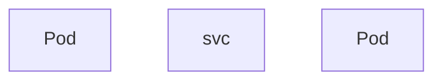
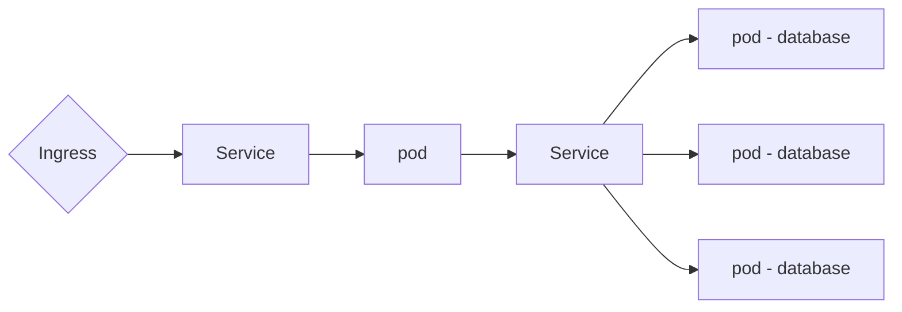

# Kubernets

线上笔记：https://geekhour.net/2023/12/23/kubernetes/

## 基本概念

Kubernetes是一个开源的容器编排引擎，
可以用来管理容器化的应用，
包括容器的自动化的部署、扩容、缩容、升级、回滚等等，
它是Google在2014年开源的一个项目，
它的前身是Google内部的Borg系统。

### 使用理由

在Kubernetes出现之前，
我们一般都是使用Docker来管理容器化的应用，
但是Docker只是一个单机的容器管理工具，
它只能管理单个节点上的容器，
当我们的应用程序需要运行在多个节点上的时候，
就需要使用一些其他的工具来管理这些节点，
比如Docker Swarm、Mesos、Kubernetes等等，
这些工具都是容器编排引擎，
它们可以用来管理多个节点上的容器，
但是它们之间也有一些区别，
比如Docker Swarm是Docker官方提供的一个容器编排引擎，
它的功能比较简单，
适合于一些小型的、简单的场景，
而Mesos和Kubernetes则是比较复杂的容器编排引擎，
Mesos是Apache基金会的一个开源项目，
而Kubernetes是Google在2014年开源的，
目前已经成为了CNCF（Cloud Native Computing Foundation）的一个顶级项目，
基本上已经成为了容器编排引擎的事实标准了。

## 资源对象

## 架构原理

Kubernetes是一个典型的Master-Woker架构，通俗来说，一个管事一个干活的。

### Woker

举个例子，一个Node中包含了应用程序Pod和数据库Pod，为了能够对外提供服务，每个节点分别内置三个组件，分别是kubelet、kube-proxy和容器运行时 container runtime。

- kubelet：他负责管理和维护每个节点上的pod，并确保他们按照预期运行，他也会定期从API-server组件接收新的或者修改后的pod规范。同时他也会监控工作节点的运行情况，然后将这些信息汇报给API-server。
- kube-proxy：负责为Pod对象提供网络代理和负载均衡服务。通常情况下，Kubernetes集群可能包含多个节点，这些节点之间通过Service来进行通信，这就需要一个负载均衡器来接收请求，然后再将请求发送到不同的节点上。它会在每个Node上启动一个网络代理，使发往Service的流量以一种高效的方式路由到正确的后端Pod中。  
- container runtime：负责拉取容器镜像 创建容器、启动或者停止容器等等，所有的应用程序都需要使用容器运行时来运行。

### Master

master节点上的组件和worker节点上的组件完全不同，有4个基本组件。

- kube-apiservice：它负责提供Kubernetes集群的API接囗服务，所有的组件都会通过这个接口来进行通信。他像一个网关，是整个系统的路口。例如新增删除修改Pod等情况都会先经过他在转发给相对应的组件处理。APIserver还负责对所有资源对象的增删改查等操作进行认证授权和访问控制。确保只有经过认证和授权的用户，才能够访问到集群中的资源对象。
- etcd：它是一个高可用的键-值存储系统，etcd和Redis比较类似也是一个键-值存储系统，用来存储集群中所有资源对象的状态信息，是整个集群的数据存储中心。这里需要注意的一点是，etcd中一般只存储集群中各种资源对象的状态信息，而应用程序中的数据一般是不会存储在etcd中的
- ControlManage：它负责管理集群中各种资源对象的状态，比如当集群中任何一个节点上的Pod发生故障的时候，必须要有一种机制来监控和检测到这个故障，然后尽可能快地对这个故障进行处理，比如重新启动这个Pod，或者使用其他的pod来代替它。
- schedule：它负责监控集群中所有节点的资源使用情况，然后根据一些调度策略，将Pod调度到合适的节点上运行
- CloudControllerManage：如果使用的是云服务商提供的Kubernetes集群，还会有一个额外的组件。云控制管理器。是一个云平台相关的控制器。负责与云平台的API进行交互。并提供一致的管理接口。

## 环境配置

### minikube

minikube是一个轻量级的Kubernetes实现
可在本地计算机上创建虚拟机并部署仅包含一个节点的简单集群。

#### Windows Install

#### Ubuntu Install

### kubectl

同创建的Kubernetes集群进行交互。

## 核心组件

### Node

一个节点就是一个物理机或者虚拟机

#### Pod

Kubernetes的最小调度单元，是一个或者多个容器的组合，他创建了一个容器的运行环境，在这个环境中，容器可以共享一些资源，例如网络存储以及一些运行时的配置等等。

假设我们的系统包含一个应用程序和一个数据库，就可以将这两个程序和数据库分别放到两个不同的Pod中。

一般情况下，我们只建议一个Pod中只放一个容器。但并不是说一个Pod中只能运行一个容器。这样可以实现应用程序的解耦和扩展。

Pod在创建的时候，会为每个Pod创建一个IP地址，Pod之间可以通过IP地址相互访问。这个IP地址是集群内部的IP地址，外部是无法访问的，Pod也不是一个稳定的实体，这意味着他们非常容易被创建和销毁。

比如发生故障的时候，Kubernetes会自动将Pod销毁掉。然后创建一个新的Pod来代替他，这个时候Pod的IP地址也会发生变化。

为了解决这个问题，Kubernetes提供了一个叫做Service的资源对象，简称svc。他可以将一组Pod封装成一个服务。这个服务可以通过一个统一的入口来访问内部的Pod。如果其中的某个Pod故障导致其IP不可用了，svc也可以将流量转发至健康的Pod。

服务也分为内部服务和外部服务。

- 内部服务是一些我们不想暴露给外部的服务。或者没有必要暴露给外部的服务。例如MySQL数据库、消息队列、缓存等，这些服务只需要在集群内部被访问就可以了。
- 有些服务是需要暴露给外部的，例如微服务的后端API部分。或者是一些给用户使用的前端页面等，外部服务有几种常见的类型，例如Node:Port，他会在节点上开放一个端口，将其映射到Service的IP地址和端口上。这样我们可以通过节点的IP地址和端口来访问Service了。

在开发和测试阶段，这类IP:Port的方式访问是没有问题的。但是在生产环境中，通常都是通过域名来访问服务的，此时用到了另外一个资源对象Ingress

### Ingress

Ingress是用来管理从集群外部，访问集群内部服务的入口和方式的，可以通过Ingress来配置不同的转发规则，从而根据不同的规则来访问集群内部不同的service，还可以通过ingress来配置域名，这样就可以将原本使用IP地址和端口号的方式，转换成使用域名的方式来访问service了，另外ingress也可以配置一些其他的功能，比如负载均衡 SSL证书等等。

### ConfigMap

Kubernetes提供了一个叫做config map的组件，它可以将一些配置信息封装起来，然后就可以在应用程序中读取和使用了，我们就可以把配置信息和应用程序的镜像内容，这样就可以保持容器化应用程序的可移植性，当数据库的地址和端口发生变化的时候，我们也只需要修改config map对象中的配置信息，然后重新加载pod就可以了。这样就实现了应用程序和数据库的解耦。

- 有一点需要注意的是，config map中的配置信息都是明文的，比如数据库的用户名或者密码等等。那么这些敏感信息就不建议存储在config map中，因为这样会带来一些安全风险和问题。

### Secret

为了解决ConfigMap的不安全问题，Kubernetes提供了另一个叫做Secret的组件，它可以将一些敏感信息封装起来，然后就可以在应用程序中读取和使用了。

- 有一点需要注意的是，这些敏感信息虽然不是以明文的形式来存储的，但是也只是做了一场base64编码而已，base64编码只是一种编码方式，并不是一种加密方式，所以仅仅只靠secret，并不能完全保证敏感信息的安全，还需要配合一些其他的手段来提高安全性。

比如Kubernetes提供的一些其他的安全机制。包括网络安全 访问控制 身份认证等等

### Volume

当容器被销毁的时候，其中的数据也会跟着被销毁，这对于一个应用程序来说是不行的。Kubernetes提供了一个叫做Volume的组件。它可以将一些持久化存储的资源，挂载到集群中的本地磁盘上，或者挂载到集群外部的远程存储上，这样即使容器被销毁或者重启，这些数据也不会丢失。也就实现了容器中数据的持久化存储。

### Deployment

如果应用程序所在的节点发生了故障，或者需要对节点进行升级和更新维护的时候，应用程序就会停止服务，这样就有可能造成一些不必要的麻烦和损失，解决方案其实也非常简单。既然一个节点不行，就多来几个节点。

Kubernetes提供了Deployement组件，它可以定义和管理应用程序的副本数量以及应用程序的更新策略，可以简化应用程序的部署和更新操作。在之前我们提到过，Pod可以理解为在容器的上面加了一层抽象，这样就可以将一个或者多个容器组合在一起，而deployment就可以理解为在Pod上面再加上一层抽象，这样就可以将一个或者多个pod组合在一起，并且还具有副本控制 滚动更新自动扩缩容等高级特性。

- 副本控制：可以定义和管理应用程序的副本数量
- 滚动更新：可以定义和管理应用程序的更新策略

### StatefulSet

数据库一般也是需要采取类似的多副本的方式来保证它的高可用性的，但不能使用类似的Deployment，需要使用StatefulSet。

StatefulSet和Deployment非常类似，也提供了定义和管理应用程序副本数量，或者动态扩缩容等等功能，此外它还保证了每个副本都有自己稳定的网络标识符和持久化存储，因此 像数据库 缓存 消息队列等等，这些有状态类的应用，以及一些保留了会话状态的应用程序，一般都需要使用StatefulSet，而不是Deployment来部署。

StatefulSet也不是万能的，部署的过程还是比较复杂和繁琐的，而且并不是所有的有状态应用都适合使用StatefulSet来部署，一种更加通用和简单的方式，是把数据库这种有状态的应用程序，从Kubernetes集群中剥离出来，在集群外单独部署，这样可以避免很多不必要的麻烦和问题，而且可以简化集群的架构和管理。

## 实践操作

