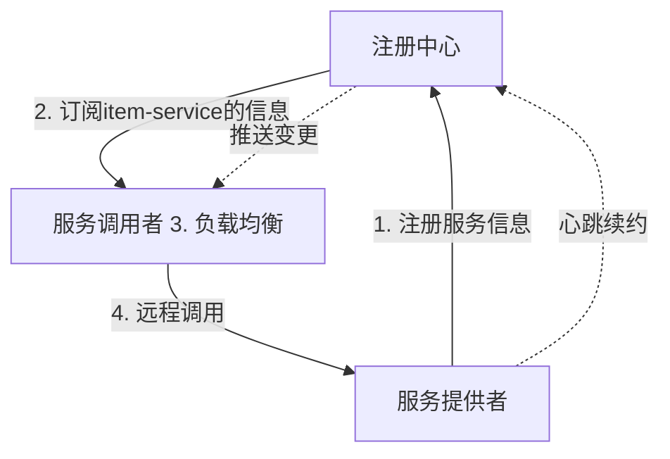

# 微服务

微服务是一种软件架构风格，他是以专注于单一职责的很多小型项目为基础，组合出复杂的大型应用

在线文档：https://b11et3un53m.feishu.cn/wiki/space/7229522334074372099?ccm_open_type=lark_wiki_spaceLink&open_tab_from=wiki_home

自动导包IDEA设置：

设置setting->编辑aditor->常规zeneral->自动导包auto import,看java区,两方框勾选上

## 前置技术

### MyBatisPlus

详见Study-Record\后端相关技术\MyBatisPlus

### Docker

详见Study-Record\计算机基础技术\MyBatisPlus


## 认识微服务

### 单体架构

将业务的所有功能集中在一个项目中开发，打成一个包部署。

- 架构简单
- 部署成本低
- 团队协作成本高
- 系统发布效率低
- 系统可用性差

单体架构适合开发功能相对简单，规模较小的项目

### 微服务

微服务架构，是服务化思想指导下的一套最佳实践架构方案。服务化，就是把单体架构中的功能模块拆分为多个独立项目。

- 粒度小
  - 按照业务功能，每个拆除去的项目都需要能做到单一职责，例如商品服务就只负责商品相关的服务。
- 团队自治
- 服务自治


### SpringCloud


SpringCloud是目前国内使用最广泛的微服务框架。

官网地址:https://spring.io/projects/spring-cloud
SpringCloud集成了各种微服务功能组件，并基于SpringBoot实现了这些组件的自动装配，从而提供了良好的开箱即用体验:

- 服务注册发现：Eureka、Nacos、Consul
- 服务远程调用：OpenFeign、Dubbo
- 服务链路监控：Zipkin、Sleuth
- 统一配置管理：SpringCloudConfig、Nacos
- 统一网关路由：SpringCloudGateway、Zuul
- 流控、降级、保护：Hystix、Sentinel

SpringCloud基于SpringBoot实现了微服务组件的自动装配，从而提供了良好的开箱即用体验。但对于SpringBoot的版本也有要求。


## 微服务拆分

### 黑马商城案例熟悉

- 黑马商城
  - 用户模块
  - 商品模块
  - 购物车模块
  - 订单模块
  - 支付模块

### 服务拆分原则

1. 什么时候拆分？
   1. 创业型项目：先采用单体架构快速开发、快速试错。随着规模扩大，逐渐拆分。
   2. 确定的大型项目：资金充足，目标明确，可直接选择微服务架构，避免后续拆分的麻烦。
2. 拆分目标
   1. 高内聚：每个微服务的职责要尽量单一，包含的业务相互关联度高、完整度高
   2. 低耦合：每个微服务的功能要相对 独立，尽量减少对其它微服务的依赖。
3. 怎么拆分
   1. 纵向拆分：按照业务模块来拆分。
   2. 横向拆分：提取公共服务，提高复用性。

### 拆分服务

有两种拆分工程的目录结构：

1. 独立Project：每个微服务都是一个Project（大型项目，耦合低）
2. Maven聚合：每个微服务都是一个Module（中小型企业受欢迎）

#### 拆分商品服务

将hm-service中与商品管理相关的功能拆分到一个微服务Module中，命名为item-service


#### 拆分购物车服务

将hm-service中与购物车有关的功能拆分到一个微服务module中，命名为cart-service


#### 拆分用户服务


#### 拆分交易服务


#### 拆分支付服务


### 远程调用

Spring给我们提供了一个RestTemplate工具，可以方便的实现Http请求的发送。使用步骤如下:

1. 注入RestTemplqte到Spring容器

   1. ```java
      @Bean
      public RestTemplate restTemplate(){
          return new RestTemplate();
      }
      ```

2. 发起远程调用

   1. ```java
      public <T> ResponseEntity<T> exchange(
      	String url,								// 请求路径
      	HttpMethod method,					// 请求方式
      	@Nullable HttpEntity<?> requestEntity, 		// 请求实体 可以为空
      	Class<T> responseType,					// 返回值类型
      	Map<String, ?> uriVariables 				// 请求参数
      )
      ```


## 服务治理

### 注册中心原理

流程如下:

1. 服务启动时就会注册自己的服务信息(服务名、IP、端口)到注册中心
2. 调用者可以从注册中心订阅想要的服务，获取服务对应的实例列表(1个服务可能多实例部署)
3. 调用者自己对实例列表负载均衡，挑选一个实例
4. 调用者向该实例发起远程调用


服务提供者会在启动时注册自己信息到注册中心，消费者可以从注册中心订阅和拉取服务信息

服务提供者通过心跳机制想向注册中心报告自己的健康状况，当心跳异常时注册中心会将异常服务剔除，并通知订阅了该服务的消费者。

消费者可以通过负载均衡算法，从多个实例中选择一个。


- 服务提供者:暴露服务接口，供其它服务调用

- 服务消费者:调用其它服务提供的接口

- 注册中心:记录并监控微服务各实例状态，推送服务变更信息




### Nacos注册中心

Nacos是目前国内企业中占比最多的注册中心组件。它是阿里巴巴的产品，目前已经加入SpringCloudAlibaba中。


- Eureka: Netflix公司出品，目前被集成在SpringCloud当中，一般用于]ava应用
- Nacos:Alibaba公司出品，目前被集成在SpringCloudAlibaba中，一般用于Java应用
  - [Nacos 快速开始 | Nacos 官网](https://nacos.io/docs/latest/quickstart/quick-start/)
  - [什么是 Nacos | Nacos](https://nacos.io/zh-cn/docs/what-is-nacos)
- Consu:HashiCorp公司出品，目前集成在SpringCloud中，不限制微服务语言


### 服务注册


```tex
PREFER_HOST_MODE=hostname
MODE=standalone
SPRING_DATASOURCE_PLATFORM=mysql
MYSQL_SERVICE_HOST=数据库所在IP地址
MYSQL_SERVICE_DB_NAME=mysql
MYSQL_SERVICE_PORT=3306
MYSQL_SERVICE_USER=root
MYSQL_SERVICE_PASSWORD=123456
MYSQL_SERVICE_DB_PARAM=characterEncoding=utf8&connectTimeout=1000&socketTimeout=3000&autoReconnect=true&useSSL=false&allowPublicKeyRetrieval=true&serverTimezone=Asia/Shanghai
```


```bash
docker run -d --name nacos --env-file ./custom.env -p 8848:8848 -p 9848:9848 -p 9849:9849 --restart=always nacos/nacos-server -e JVM_XMS=256m -e -e MODE=standalone
```


### 服务发现


