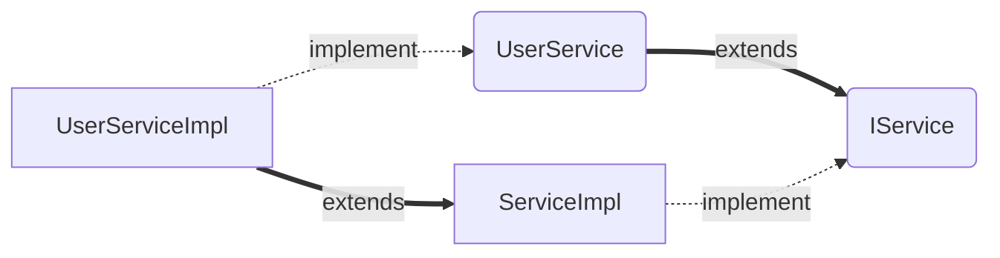

# MyBatisPlus

官网：https://www.baomidou.com


## 快速入门

### 入门案例

1. 引入MyBatisPlus起步以来

   1. MyBatisPlus官方提供了starter，其中集成了Mybatis和MybatisPlus的所有功能，并且实现了自动装配效果。
      因此我们可以用MybatisPlus的starter代替Mybatis的starter

   2. ```xml
      <!--MybatisPlus-->
      <dependency>
          <groupId>com.baomidou</groupId>
          <artifactId>mybatis-plus-boot-starter</artifactId>
          <version>3.5.3.1</version>
      </dependency>
      ```

2. 自定义的Mapper继承MyBatisPlus提供的BaseMapper接口：

   1. ```java
      public interface UserMapper extends BaseMapper<实体类泛型>{
          
      }
      ```

   2. 可以使用父类内置的方法进行CRUD

   3. 例如：userMapper.insert()、userMapper.selectById()、userMapper.selectBatchIds()、userMapper.updateById()等 

### 常见注解

MyBatisPlus通过扫描实体类，并居于反射获取实体类信息作为数据库表信息

- 类名驼峰转下划线作为表名
- 名为id的字段作为主键
- 变量名驼峰转下划线作为表的字段名

MybatisPlus中比较常用的几个注解如下

- @TableName:用来指定表名
- @Tableld:用来指定表中的主键字段信息
  - type属性：IdType. 枚举值
    - AUTO：数据库自增长
    - INPUT：通过set方法自行输入
    - ASSIGN_ID：分配ID，接口IdentifierGenerator的方法nextId来生成id，默认实现类为DefaultIdentifierGenerator雪花算法
- @TableField:用来指定表中的普通字段信息
  - 成员变量名与数据库字段名不一致
  - 成员变量名以is开头，且是布尔值
  - 成员变量名与数据库关键字冲突

```java
@TableName("tb_user")
public class User{
        @TableId(value="id",type= IdType.AUTO )
        private Long id;
	@TableField("username")
        private String name;
        @TableField("is_married")
        private Boolean isMarried;
        @TableField("`order`")
        private Integer order;
        @TableField(exist = false)
        private String address;
}
```

| 名称       | 数据类型 | 默认约束       |
| ---------- | -------- | -------------- |
| id         | bigint   | AUTO_INCREMENT |
| username   | varchar  | 无默认值       |
| is_married | bit      | 0              |
| order      | tinyint  |                |

### 常见配置

MyBatisPlus的配置项继承了MyBatis原生配置和一些自己特有的配置。例如:

```yml
mybatis-plus:
	type-aliases-package:com.itheima.mp.domain.po #别名扫描包
	mapper-locations:"classpath*:/mapper/**/*.xml" # Mapper.xml文件地址，默认值
	configuration:
		map-underscore-to-camel-case:true #是否开启下划线和驼峰的映射
		cache-enabled:false #是否开启二级缓存
	global-config:
		db-config:
			id-type:assign_id # id为雪花算法生成
			update-strategy:not_null # 更新策略:只更新非空字段
```


## 核心功能

### 条件构造器

MyBatisPlus支持各种复杂的where条件，可以满足日常开发的所有需求，其中Wrapper就是我们所称的条件构造器

- BaseMapper
  - delete(Wrapper<T>):int
  - update(T, Wrapper<T>): int
  - selectOne(Wrapper<T>): T
  - exists(Wrapper<T>): boolean
  - selectCount(Wrapper<T>): Long
  - selectList(Wrapper<T>): List<T>
  - selectMaps(Wrapper<T>): List<Map<String, Object>>
  - selectObjs(Wrapper<T>): List<Object>
  - selectPage(P, Wrapper<T>): P
  - selectMapsPage(P, Wrapper<T>): P


- AbstractWrapper
  - getEntity():T ↑Wrapper
  - setEntity(T): Children
  - getEntityClass(): Class<T>
  - setEntityClass(Class<T>): Children
  - allEq(boolean, Map<R, V>, boolean): Children ↑Compare
  - allEq(boolean, BiPredicate<R, V>, Map<R, V>, boolean): Children ↑Compare
  - eq(boolean, R, Object): Children ↑Compare
  - ne(boolean, R, Object): Children ↑Compare
  - gt(boolean, R, Object): children ↑Compare
  - ge(boolean, R, object): Children ↑Compare
  - lt(boolean, R, Object): Children ↑Compare
  - le(boolean, R, Object): Children ↑Compare
  - like(boolean, R, Object): Children ↑Compare
  - notLike(boolean, R, Object): Children ↑Compare
  - likeLeft(boolean, R, Object): Children ↑Compare
  - likeRight(boolean, R, object): children ↑Compare
  - notLikeLeft(boolean, R, Object): Children ↑Compare
  - notLikeRight(boolean, R, object): children ↑Compare
  - between(boolean, R, object, Object): children ↑Compare
  - notBetween(boolean, R, object, object): Children ↑Compare


#### 简单案例

1. 查询出名字中带o的，存款大于等于1000员的人的ID、username、info、balance字段。

   1. 原生SQL：

      1. ```mysql
         select id,username,info,balance from user where username like ? and balance >= ?
         ```

   2. MyBaticPlus：

      1. ```java
         @SpringBootTest
         class MapperTest{
         
         @Test
         void testQueryWrapper(){
             // 1. 构建查询条件
             QueryWrapper<User> wrapper = new QueryWrapper<User>()
                 .select("id","username","info","balance")
                 .like("username","o")
                 .ge("balance",1000);
             // 2. 查询
             List<User> users = userMapper.selectList(wrapper);
             users.forEach(System.out::println)
         }
         
         @Test
         void testLambdaQueryWrapper(){
             // 1. 构建查询条件
             LambdaQueryWrapper<User> wrapper = new LambdaQueryWrapper<User>()
                 .select(User::getId,User::getUsername,User::getInfo,User::getBalance)
                 .like(User::getUsername,"o")
                 .ge(User::getBalance,1000);
             // 2. 查询
             List<User> users = userMapper.selectList(wrapper);
             users.forEach(System.out::println)
         }
         }
         ```

2. 更新用户名Jack的用户的余额为2000

   1. 原生SQL：

      1. ```mysql
         update user set balance = 2000 where username = "jack"
         ```

   2. MyBaticPlus：

      1. ```java
         @Test
         void testUpdateByQueryWrapper(){
             // 1. 要更新的数据
             User user = new User();
             user.setBalance(2000);
             // 2. 更新的条件
             QueryWrapper<User> wrapper = new QueryWrapper<User>().eq("username","jack");
             // 3. 执行更新
             userMapper.update(user, wrapper)
         }
         ```

3. 更新id为1，2，4的用户的余额，扣200

   1. 原生SQL：

      1. ```mysql
         update user set balance = balance -200 where id in (1,2,4)
         ```

   2. MyBaticPlus：

      1. ```java
         @Test
         void testUpdateByQueryWrapper(){
             // 1. 要更新的数据
             List<Long> ids = List.of(1L,2L,4L);
             // 2. 设定SQL
             UpdateWrapper<User> wrapper = new UpdateWrapper<>()
                 .setSql("balance = balance -200")
                 .in("id", ids);
             // 3. 执行更新
             userMapper.update(null, wrapper)
         }
         ```

### 自定义SQL

我们可以利用MyBatisPlus的Wrapper来构建复杂的Where条件，然后自己定义SQL语句中剩下的部分。

- 基于Wrapper构建Where条件

  ```java
  List<Long>ids =List.of(1L2
  int amount =200;
  // 1.构建条件
  LambdaQueryWrapper<User> wrapper = new LambdaQueryWrapper<User>().in(User::getId, ids);
  // 2.自定义SQL方法调用
  userMapper.updateBalanceByIds(wrapper，amount);
  ```

- 在Mapper方法参数中用Param注解声明Wrapper变量名称，必须是ew

  ```java
  void updateBalanceByIds(@Param("ew") LambdaQueryWrapper<User> wrapper, @Param("amount") int amount);
  ```

- 自定义SQL，并使用Wrapper条件

  ```xml
  <update id="updateBalanceByIds">
  	UPDATE tb_user SET balance = balance- #{amount} ${ew.customSqlSegment}
  </update>
  ```

  

#### 简单案例

1. 将id在指定范围的用户(例如1、2、4)的余额扣减指定值

   1. SQL XML：

      1. ```xml
         <update id="updateBalanceByIds">
         	update user
             	set balance = balance = #{amount}
             	where id in 
             	<foreach collection="ids =" separator="," item="id" open="(" close=")">
                     	#{id}
         	    </foreach>
         </update>
         ```

   2. MyBaticPlus：

      1. ```java
         @SpringBootTest
         class MapperTest{
         
         // <1> Service层方法
         @Test
         void testUpdateByQueryWrapper(){
             // 1. 要更新的数据
             List<Long> ids = List.of(1L,2L,4L);
             int amount =200;
             // 2. 定义条件
             QueryWrapper<User> wrapper = new QueryWrapper<User>().in("id",ids);
             // 3. 掉用自定义SQL
             userMapper.updateBalanceByIds(wrapper,amount)
         }
         
         // <2> Mapper层方法
         //void updateBalanceByIds(@Param("ew") QueryWrapper<User> wrapper,@Param("amount") int amount)
         void updateBalanceByIds(@Param(Constants.WRAPPER) QueryWrapper<User> wrapper,@Param("amount") int amount);
          
         // <3> Mapper XML文件
         <update id="updateBalanceByIds"
             UPDATE tb user SET balance =balance - #{amount} ${ew.customsqlSegment} 
         </update>
             
         }
         ```
### IService接口

1. 我们的自定义接口需继承IService接口
2. 我们的实现类需要去继承MyBatisPlus为我们准备好的ServiceImpl实现类



```java
// < 1 > 自定义的用户接口 需要继承IService并指定实体类
public interface IUserService extends IService<User>{
    
}
// < 2 > 自定义的用户接口实现类 需要继承ServiceImpl、IUserService，并指定Mapper和实体类
@Service
public class UserServiceImpl extends ServiceImpl<userMapper, User> implements IUserService{
    
} 
```

Tip:小知识：可以使用final对依赖进行注入。使用Lombok对哪些需要注入的变量自行创建构造函数

```java
// < 1 > Controller 层
@Api(tags ="用户管理接口")
@RequestMapping("/users")
@RestController
@RequiredArgsConstructor // 对需要注入的变量自行创建构造函数
public class Usercontroller {

    // 通过Final修饰依赖字段，保证依赖在对象生命周期内不变
    private final IUserService userService;
    
    @ApiOperation("新增用户接口")
    @PostMapping
    public void saveUser(@RequestBody UserFormDTo userDTo){
    
    }
    
    @Api0peration("根据id查询用户接口")
    @GetMapping("id}")
    public userVo queryUserById(@ApiParam("用户id") @Pathvariable("id") Long id){
        // 1.查询用户PO
	User user =userService.getById(id);
        // 2.把Po拷贝到v0
	return BeanUtil.copyProperties(user,UserV0.class);
    }
    
    @Api0peration("根据id批量查询用户接口")
    @GetMapping
    public List<Uservo> queryUserByIds(@ApiParam("用户id集合")@RequestParam("ids")List<Long> ids){
        //1.查询用户PO
	List<User>users =userservice.listByIds(ids);
	//2.把P0拷贝到v0
	return BeanUtil.copyToList(users,Userv0.class);
    }
    
    // 针对特殊业务 需要使用自定义SQL片段
    // 此处案例为扣减用户余额
    // 需要先检测用户是否被冻结、用户余额是否足够支付
    @ApiOperation("扣减用户余额接口")
    @PutMapping("/{id}/deduction/{money}")
    public void deductBalance(@ApiParam("用户id")@PathVariable("id") Long id,@ApiParam("扣减的金额")@PathVariable("money")Integer money){
        userService.deductBalance(id, money);
    }
}

// < 2 > IService
public interface IUserService extends IService<User>{
    void deductBalance(Long id, Integer money);
}

// < 3 > Service层
@Service
public class UserServiceImpl extends ServiceImpl<UserMapper, User> implements IUserservice {
    @Override
    public void deductBalance(Long id,Integer money){
        //1.查询用户
	User user = getById(id);
	//2.校验用户状态
	if(user ==nulluser.getstatus()== 2){
		throw new RuntimeException("用户状态异常!");
        }
	//3.校验余额是否充足
	if(user.getBalance()<money){
		throw new RuntimeException("用户余额不足!");
        }
        //4.扣减余额update tbuser set balance =balance -?
        baseMapper.deductBalance(id,money);
    }
} 

// < 4 > UserMapper层
public interface UserMapper extends BaseMapper<User>{
    List<User>queryUserByIds(@Param("ids")List<Long> ids);
    void updateBalanceByIds(@Param(constants.WRAPPER) QueryWrapper<User> wrapper, @Param("amount") int aount);
    
    @Update("UPDATE tb_user SET balance = balance - #{money} WHERE id = #{id}")
    void deductBalance(@Param("id")Long id, @Param("money")Integer money);
}
```

#### 简单案例 IService的Lambda查询

1. 实现一个根据复杂条件查询用户的接口，查询条件如下

   1. name：用户关键字，可以为空

   2. status：用户状态，可以为空

   3. minBalance：最小余额，可以为空

   4. maxBalance：最大余额，可以为空

   5. SQL XML：

      1. ```xml
         <select id="queryUsers" resultType="com.itheima.mp.domain.po.User">
             SELECT * FROM tb_user
         	<where>
         		<if test="name != null">AND username LIKE #{name}</if>
         		<if test="status != nul">AND `status`= #{status}</if>
                 	<if test="minBalance != null and maxBalance != null">
                         	AND balance BETWEEN #{minBalance} AND #{maxBalance]
                 	</if>
         	</where>
         </select>
         ```

   6. MyBaticPlus：

      1. ```java
         // < 1 > Controller 层
         @Api(tags ="用户管理接口")
         @RequestMapping("/users")
         @RestController
         @RequiredArgsConstructor // 对需要注入的变量自行创建构造函数
         public class Usercontroller {
         
             // 通过Final修饰依赖字段，保证依赖在对象生命周期内不变
             private final IUserService userService;
            
             // UserQuery实体类中需要包含name、status、minBalance、maxBalance以符合本案例需求
             @Api0peration("根据复杂条件查询用户接口")
             @GetMapping
             public List<Uservo> queryUserByIds(@ApiParam(UserQuery query){
                 //1.查询用户PO
         	List<User>users =userservice.queryUsers(query.getName(),query.getStatus(),query.getMinBalance(),query.getMaxBalance())
         	//2.把P0拷贝到v0
         	return BeanUtil.copyToList(users,Userv0.class);
             }
         }
                                                
                                                
                                                
         // < 2 > IService
         public interface IUserService extends IService<User>{
             List<User> queryUsers(String name, Integer status, Integer minBalance, Integer maxBalance);
         }
         
         // < 3 > Service层
         @Service
         public class UserServiceImpl extends ServiceImpl<UserMapper, User> implements IUserservice {
                 @Override
         	public List<User> queryUsers(String name, Integer status, Integer minBalance, Integer maxBalance){
                 	return lambdaQuery()
                         	.like(name!=null, User::getUsername,name)
                         	.eq(status!=null, User::getStatus,status)
                         	.gt(minBalance!=null, User::getBalance,minBalance)
                         	.lt(maxBalance!=null, User::getBalance,maxBalance)
                         	.list();
                 }
         } 
         ```

#### 简单案例 IService批量新增

1. 批量插入10万条用户数据，并做出对比

   1. 普通For循环插入：效率低

   2. IService的批量插入

      1. 开启rewriteBatchedStatements=true参数：这个是Mysql的配置

      2. ```yml
         spring:
         	datasource:
         		driver-class-name: com.mysql.cj.jdbc.Driver
         		url: jdbc:mysql://127.0.0.1:3306/mp?useUnicode=true&characterEncoding=UTF-8&autoReconnect=true&serverTimezone=Asia/shanghai&rewriteBatchedStatements=true
         		username: root
         		password: MySOL123
         ```

   3. MyBaticPlus：

      1. ```java
         @Test
         void testSaveBatch(){
         	// 我们每次批量插入1000条件，插入100次即10万条数据
         	//1.准备一个容量为1000的集会
         	List<User>list =new ArrayList<>( initialCapacity: 1000);
                 long b= System.currentTimeMillis();
                 for(inti=1;i<=100000;i++){
                         //2.添加一个userlist.add(builduser(i));//3.每1000条批量插入一次
         		if(i%1000 == 0){
         			userservice.saveBatch(list);// 4.清空集合，准备下一批数据
         			list.clear();
                 	}
                         list.add(builduser(i));//3.每1000条批量插入一次
                         if(i%1000 == 0){
                             userservice.saveBatch(list);// 4.清空集合，准备下一批数据
                             list.clear();
                         }
                 }
                 long e= system.currentTimeMillis();
                 System.out.println("耗时:"+(e- b));
          }
         ```

## 扩展功能

### 代码生成

部分固定的如实体类、创建Service层等代码生成工具

https://www.baomidou.com

MyBatisPlus插件

### 静态工具

一旦业务场景中出现Service中相互掉用Service层的情况，推荐使用静态工具类Db类来处理，避免循环依赖的问题。

```java
// 查询地址
List<Address> addresses = Db.lambdaQuery(Address.class)
    .eq(Address::getUserId,id).list()
    //3.封装V0
    // 3.1.转ser的PO为VO
    Uservo userVo = BeanUtil.copyProperties(user, Userv0.class);
// 3.2.转地址VO
    if(collutil.isNotEmpty(addresses)){
        userVo.setAddresses(Beanutil.copyToList(addresses, Addressv0.class));
return userVo;
```


### 逻辑删除

逻辑删除就是基于代码逻辑模拟删除效果，但并不会真正删除数据。思路如下:

- 在表中添加一个字段标记数据是否被删除
- 当删除数据时把标记置为1
- 查询时只查询标记为0的数据

MybatisPlus提供了逻辑删除功能，无需改变方法调用的方式，而是在底层帮我们自动修改CRUD的语句。我们要做的就是在application.yaml文件中配置逻辑删除的字段名称和值即可:

```yaml
mybatis-plus:
    global-config:
        db-config:
            logic-delete-field: flag # 全局逻辑删除的实体字段名，字段类型可以是boolean、integer、String等
            logic-delete-value: 1 #逻辑已删除值(默认为 1)
            logic-not-delete-value: 0 #逻辑未删除值(默认为 )
```


### 枚举处理器

 MyBatisEnumTypeHandler

  在application.yml中配置 局枚举处理器

```yaml

mybatis-plus:
    configuration:
	    default-enum-type-handler: com.baomidou.mybatisplus.core.handlers.MybatisEnumTypeHandler	
```


```java
@Getter
public enum UserStatus {
	NORMAL(1, "正常"),
	FROZEN(2, "冻结"),
        ;
	@EnumValue
        @JsonValue
	private final int value;
        private final String desc;
	
        UserStatus(int value, String desc){
		this.value = value;
        	this.desc = desc;
        }
}
```


### JSON处理器

 ```java
@Data
@TableName(value="user",autoResultMap = true )
public class User {
    private Long id;
    private String username;
    @TableField(typeHandler = JacksonTypeHandler.class)
    private UserInfo info;
}
 ```


## 插件功能

MyBatisPlus提供的内置拦截器有下面这些：

| 序号 | 拦截器                           | 描述                               |
| ---- | -------------------------------- | ---------------------------------- |
| 1    | TenantLineInnerInterceptor       | 多租户插件                         |
| 2    | DynamicTableNameInnerInterceptor | 动态表名插件                       |
| 3    | PaginationInnerInterceptor       | 分页插件                           |
| 4    | OptimisticLockerInnerInterceptor | 乐观锁插件                         |
| 5    | IllegalSQLInnerInterceptor       | SQL性能规范插件，检测并拦截垃圾SQL |
| 6    | BlockAttackInnerInterceptor      | 防止全表更新和删除的插件           |


### 分页插件

首先要在配置类中注册MyBatisPlus的核心插件，同时添加分页插件，其原理是基于拦截器实现的。

```java
@Configuration
public class MybatisConfig{
@Bean
	public MybatisPlusInterceptor mybatisPlusInterceptor(){
        //1.初始化核心插件
        MybatisPlusInterceptor interceptor = new MybatisPlusInterceptor();
        //2.添加分页插件
        PaginationInnerInterceptor pageInterceptor = new PaginationInnerInterceptor(DbType.MysOL);
        pageInterceptor.setMaxLimit(1000L);
        //设置分页上限
        interceptor.addInnerInterceptor(pageInterceptor);
        return interceptor;
    }
}
```

接着就可以使用分页的API了

```java
@Test
void testPageQuery(){
    //1.查询
    int pageNo=1，pageSize =5;
    //1.1.分页参数
    Page<User>page=Page.of(pageNo，pageSize);
    //1.2.排序参数，通过0rderItem来指定
    page.addOrder(new OrderItem("balance",false));
    //1.3.分页查询  b  
    Page<User>p=userService.page(page);
    //2.总条数
    System.out.println("total ="+ p.getTotal());
    //3.总页数
    System.out.println("pages="+ p.getPages());
    // 4.分页数据
    List<User>records =p.getRecords();records.forEach(System.out::println);
}
```

#### 通用分页实体

分页实体类

```java
@Data
@ApiModel(description ="分页查询实体")
public class PageQuery {
    @ApiModelProperty("页码")
    private Integer pageNo;
    @ApiModelProperty("页码")
    private Integer pagesize;
    @ApiModelProperty("排序字段")
    private string sortBy;
    @ApiModelproperty("是否升序")
    private Boolean isAsc;
}
```

业务实体类

```java
@Data
@ApiModel(description ="用户查询条件实体")
public class UserQuery extends PageQuery{
    @ApiModelProperty("用户名关键字")
    private String name;
    @ApiModelProperty("用户状态:1-正常，2-冻结")
    private Integer status;
    @ApiModelProperty("余额最小值")
    private Integer minBalance;
    @ApiModelProperty("余额最大值")
    private Integer maxBalance;
}
```

输出结果实体类

```java
@Data
@ApiModel(description ="分页结果")
public class PageDTO<T>{
    @ApiModelProperty("总条数")
    private Long total;
    @ApiModelProperty("总页数")
    private Long pages;
    @ApiModelproperty("集合")
    private List<T> list;
}
```

Controller层

```java
@Api0peration("根据条件分页查询用户接口")
@GetMapping("/page")
public PageDTo<Userv0> queryUsersPage(UserQuery query){
    return userservice.queryUsersPage(query);
}
```

Service层（省略IService接口）

```java
 @Override
public PageDTo<Userv0>queryUsersPage(UserQuery query){
    String name =query.getName();
    Integer status =query.getstatus();
    //1.构建分页条件
    //1.1.分页条件
    Page<User>page = Page.of(query.getPageNo(),query.getPagesize());
    // 1.2.排序条件
    if(strutil.isNotBlank(query.getsortBy())){
        // 不为空
        page.addorder(new 0rderItem(query.getSortBy(), query.getIsAsc()));
    }else{
        //为空，默认按照更新时间排序
        page.addOrder(new OrderItem( column: "update time".asc:false));
    }
    
    Page<User>p=lambdaQuery()
        .like( condition: name != null,User::getUsername, name)
        .eq( condition: status != null, User::getstatus, status)
        .page(page);
    //3.封装V0结果
    PageDTO<Uservo>dto = new PageDTO<>();
    //3.1.总条数
    dto.setTotal(p.getTotal());
    //3.2.总页数
    dto.setPages(p.getPages());
    //3.3.当前页数据
    List<User>records =p.getRecords();
    if(Collutil.isEmpty(records)){
        dto.setList(Collections.emptyList());
        return dto;
    }
    //3.4.拷贝user的VO
    dto.setList(BeanUtil.copyToList(records, uservo.class));
    // 4.返回
    return dto;
}
```

#### 通用分类实体与MP的转换

4.1.1 节可看出诸多不方便的地方，如一些通用的方法可以进行抽象封装以及DTO与VO互转等情况。

- 在PageQuery中定义方法，将PageQuery对象转换为MyBatisPlus中的Page对象
- 在PageDTO中定义方法，将MyBatisPlus中的Page结果转为PageDTO结果

建议手写一个Utils来进行解耦

```java
@Data
@ApiModel(description ="分页查询实体")
public class PageQuery {
    @ApiModelProperty("页码")
    private Integer pageNo;
    @ApiModelProperty("页码")
    private Integer pagesize;
    @ApiModelProperty("排序字段")
    private string sortBy;
    @ApiModelproperty("是否升序")
    private Boolean isAsc;
    
    public<T>Page<T> toMpPage(OrderItem ... items){
        //1.分页条件
        Page<User>page =Page.of(pageNo，pagesize);
        //2.排序条件
        if(strutil.isNotBlank(sortBy)){
            // 不为空
            page.addOrder(new OrderItem(sortBy,isAsc));
        }else if(items !=null){
            // 为空，默认排序
            page.addOrder(items);
        }
        return page;
    }
    
    public<T>Page<T> toMpPageDefaultSortByCreateTime(){
    	return toMpPage(new OrderItem("create_time",false));
    }
}
```

```java
@Data
@ApiModel(description ="分页结果")
public class PageDTO<T>{
    @ApiModelProperty("总条数")
    private Long total;
    @ApiModelProperty("总页数")
    private Long pages;
    @ApiModelproperty("集合")
    private List<T> list;
    
    public static <PO,VO>PageDTO<VO>of(Page<PO>p, class<VO> clazz){
        PageDT0<VO>dto = new PageDTO<>();
        //1.总条数
        dto.setTotal(p.getTotal());
        //2.总页数
        dto.setPages(p.getPages());
        //3.当前页数据
        List<Po>records =p.getRecords();
        if(collutil.isEmpty(records)){
            dto.setList(Collections.emptyList());
            return dto;
        }
        // 4.拷贝user的VO
        dto.setList(Beanutil.copyToList(records，clazz));
        // 5.返回
        return dto;
    }
    
    
    public static <PO,VO>PageDTO<VO>of(Page<PO>p, Function<PO,VO> convertor){
        PageDT0<VO>dto = new PageDTO<>();
        //1.总条数
        dto.setTotal(p.getTotal());
        //2.总页数
        dto.setPages(p.getPages());
        //3.当前页数据
        List<Po>records =p.getRecords();
        if(collutil.isEmpty(records)){
            dto.setList(Collections.emptyList());
            return dto;
        }
        // 4.拷贝user的VO
        dto.setList(records.stream().map(convertor).collect(Collectors.toList()));
        // 5.返回
        return dto;
    }
}
```


```java
 @Override
public PageDTo<Userv0>queryUsersPage(UserQuery query){
    String name =query.getName();
    Integer status =query.getstatus();
    //1.构建分页条件
    Page<User>page = query.toMpPageDefaultSortByUpdateTime();
    
    // 2. 分页查询
    Page<User>p=lambdaQuery()
        .like( condition: name != null,User::getUsername, name)
        .eq( condition: status != null, User::getstatus, status)
        .page(page);
    //3.封装V0结果
    //return PageDTO.of(p, UserVo.class);
    return PageDTO.of(p, user ->{
        //1.拷贝基础属性
        UserVO vo =BeanUtil.copyProperties(user,Userv0.class);
        // 2.处理特殊逻辑
        vo.setUsername(vo.getUsername().substring(0, vo.getUsername().length()- 2)+ "**");
        return vo;
    });
    
}
```

