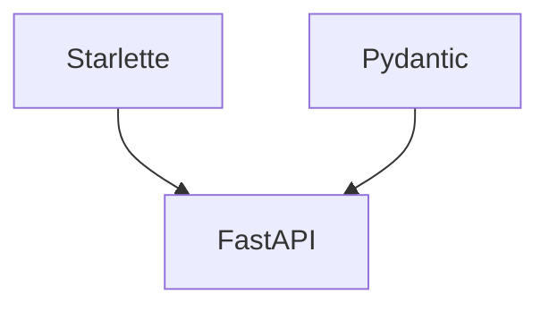
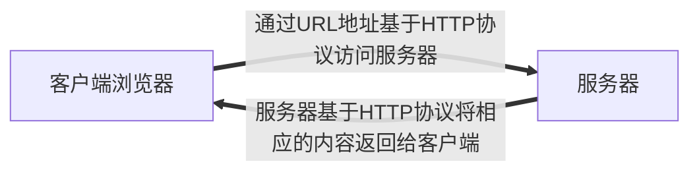

# FastAPI

一个用于构建API的现代快速的web框架

线上笔记（全面）[0. Tortoise ORM & Sqlalchemy 区别 (yuque.com)](https://www.yuque.com/u1362970/xyh2wn/zrkhd38xxx80hx7u)

Starlette负责Web部分 https://www.starlette.io

Pydantic负责数据部分 https://pydantic-docs.helpmanual.io

需要Python3.7以上版本





## 『 0 』预备知识点

### Http协议

引言

1. 什么是请求头请求体？响应体和响应头？
2. URL地址包括什么？
3. get请求和post请求到底是什么？
4. Content-Type是什么？

#### 简介



#### HTTP协议特性

1. 基于TCP/IP协议之上的应用层协议
2. 基于请求、响应模式
3. 无状态保存：HTTP协议本身不对请求和响应之间的通信状态进行保存。
4. 短链接：
   1. HTTP1.0默认使用短链接，浏览器和服务器每进行一次HTTP操作，就建立一次链接，任务结束就中断链接。
   2. HTTP1.1起。默认使用长链接。要使用，客户端和服务器的HTTP头部的Connection都要设置为keep-alive才支持
   3. HTTP长连接，是指服用TCP链接。多个HTTP请求可以复用同一个TCP链接。

#### 请求协议与响应协议

一个完整的URL包括：协议、IP、端口、路径、参数

- GET 请求提交的数据会放在URL之后，以？分割URL和传输数据，参数之间与&相连。POST请求时发提交的数据放在HTTP包的请求体中。
- GET提交的数据大小有所限制，因为部分浏览器对URL的长度有限制。POST则没有。

HTTP请求协议由三部分构成

- 请求首行：请求方式 + URL路径和参数 + HTTP协议
- 请求头：
- 请求体。

```bash
# 请求首行
POST /api/login?loginWay=xxx
# 请求头
# content-type 告诉服务器我数据是什么类型的
content-type:application/json
user-agent: Chrome/104.0.0.1 Safari/537.36
# 空行

# 请求体
{
	username:"yaun",
	password:"123"
}
```

HTTP响应协议由三部分构成

响应首行、响应头、响应体

```bash
# 响应首行
HTTP/1.1 200 OK
# 响应头
# content-type 告诉客户端我数据打包成什么类型的
content-type: application/json
date: Sun. 28 Aug 2022 13:34:31 GMT
# 空行

# 响应体
{
	"code": -1,
	"msg": "success",
	"data": null
}
```


### API 接口

开发Web应用中有两种应用模式：前后端不分离和前后端分离

应用程序编程接口（API接口）就是应用程序对外提供了一个操作数据的入口。这个入口可以是一个函数或类方法，也可以是一个URL地址或者一个网络地址，当客户端调用这个入口，应用程序会执行对应代码操作。给客户端完成相对应的功能。

目前市面上常用的接口实现规范有

- Restful ：一种专门为Web开发而定义的API接口设计风格，尤其适用于前后端分离的应用模式中
- RPC

关键是面向资源开发

GET /student --> select

POST /student --> add

POST /student/1 --> select id

PUT /student/1 --> alter

DELETE /student/1 --> delete


## 『 1 』快速开始

### 简单案例

- 安装

```bash
pip install fastapi
```

还会需要一个ASGI服务器，生产环境可以使用Uvicorn

```bash
pip install uvicorn
```

- 代码

```python
# FastAPI 是个为你的API提供了所有功能的Python类
from fastapi import FastAPI

import uvicorn
# 这个示例是创建你所有API的主要交互对象
app = FastAPI()

@app.get("/")
async def home():
    return {"user_id": 101}

```

- 通过以下命令启动

```bash
uvicorn quickstart:app --reload
```

- 也可以通过配置相关选项信息启动

```python
if __name__ == '__main__'
	uvicorn.run("要运行的py代码名称:自定义的fastAPI实例",port=8080,debug=True,reload=True)
    
if __name__ == '__main__'
	uvicorn.run("quickstart:app",port=8080,debug=True,reload=True)
```


### 自动接口文档

 ```
https://localhost:端口号/docs
 ```


## 『 2 』路径操作

### 装饰器

fast支持各种请求方式，包括

```python
@app.get()
@app.post()
@app.put()
@app.patch()
@app.delete()
@app.options()
@app.head()
@app.trace()

```


### 路径操作装饰器参数

```python
@app.post("/items",tags=["这是一个测试接口"])
def test():
    return {"items":"items"}
```


| 参数                 | 接受参数                                  | 说明             |
| -------------------- | ----------------------------------------- | ---------------- |
| tags                 | tags=["这是一个测试接口"]                 | 影响文档中的信息 |
| summary              | summary=["这是一个测试总结"]              | 影响文档中的信息 |
| description          | description=["这是一个测试总结"]          | 影响文档中的信息 |
| response_description | response_description=["这是一个测试总结"] | 影响文档中的信息 |
| deprecated           | deprecated=True                           | 是否废弃接口     |


### 路由分发

我们一般希望在有多个应用的时候，不要把所有路由写在单个文件中。

假设目录下有App01.py和App02.py两个子模块

```python
# APP01.py
# 1. 导入APIRouter路由
from fastapi import APIRouter

# 2. 定义路由
shop = APIRouter()

# 3. 编写路由接口
@shop.get("/food")
def shop_food():
    return {"shop": "food"}

```

```python
# APP02.py
# 1. 导入APIRouter路由
from fastapi import APIRouter

# 2. 定义路由
user = APIRouter()

# 3. 编写路由接口
@user.get("/login")
def shop_food():
    return {"user": "tation"}
```


在主模块中分发路由

```python
# 1. 导入FastAPI
from fastapi import FastAPI

# 2. 分别导入各个子模块定义的路由
from start.apps.app01 import shop
from start.apps.app02 import user

# 3， 定义
app = FastAPI()

# 4. 分发路由 分别设置前缀 和 接口文档信息
app.include_router(shop, prefix="/shop", tags=["购物中心接口"])
app.include_router(user, prefix="/user", tags=["用户中心接口"])

if __name__ == '__main__':
    uvicorn.run("quickstart:app", port=8080, reload=True)


```


## 『 3 』请求与响应


### 路径参数


```python
from fastapi import APIRouter

user = APIRouter()

# 用{}来获取路径参数
# 路径{}参数要和函数值中的类型一一对应
@user.get("/{id}")
def get_user_by_id(id: int):
    return [
        {
            "uid": id,
            "username": "张三"
        },
        {
            "uid": "U00002",
            "username": "李四"
        },
    ]

```


### 查询参数（ 请求参数 ）

路径参数中如果声明了不属于路径参数的其他函数参数的时候，它会被自动解释为查询字符串参数，就是URL?之后用&分割的键值对

可以通过设置默认参数 即 = None设置成不必须（即前端可以不必须传入这个参数）

```python
from fastapi import APIRouter, Form, File, UploadFile, Request
from typing import Union, Optional, List
from pydantic import BaseModel, Field, field_validator
from datetime import date, datetime
import os

UserRouter = APIRouter()


@user.get("")
def get_user_list(username: str = None): # 没有默认参数则可选，否则必传
    return [
        {
            "uid": "U00001",
            "username": "张三"
        },
        {
            "uid": "U00002",
            "username": "李四"
        },
    ]
```


如果设置一个参数能有多种不同的数据类型时，可以从typing导入Union模块 设置Union，使其接受时选择其中一种类型传入。也可以通过设置默认值变成可选项

另外，当Union中包含None值的时候，可以使用Optional关键字来代替，相当于Union[str, None] = Optional[str]

```python
from fastapi import APIRouter, Form, File, UploadFile, Request
from typing import Union, Optional, List
from pydantic import BaseModel, Field, field_validator
from datetime import date, datetime
import os

UserRouter = APIRouter()


@user.get("")
def get_user_list(username: str = None, password: Union[str, int] = None,gender: Optional[str]):
    return [
        {
            "uid": "U00001",
            "username": "张三"
        },
        {
            "uid": "U00002",
            "username": "李四"
        },
    ]

```


### 请求体

当你需要将数据从客户端(例如浏览器)发送给 API时，你将其作为「请求体」发送。请求体是客户端发送给 API 的数据。响应体是 API 发送给客户端的数据。

FastAPI 基于 Pydantic ， Pydantic 主要用来做类型强制检查(校验数据)。

```bash
pip install pydantic
```

不符合类型要求就会抛出异常。对于 API服务，支持类型检查非常有用，会让服务更加健壮，也会加快开发速度，因为开发者再也不用自己写一行一行的做类型检查。


```python
from fastapi import APIRouter
from typing import Union, Optional, List
from pydantic import BaseModel, Filed
from datetime import date, datetime

UserRouter = APIRouter()


class Address(BaseModel):
    province: str
    city: str
    region: str


# 创建一个用户类对象，继承自 pydantic 的 BaseModel
class User(BaseModel):
    uid: int
    # 给姓名添加正则约束，必须以以a开头
    username: str = Field(pattern="^a.*")
    # 给年龄限定约束，默认为0，上线100，下限0，超过这个范围区间直接报错
    age: int = Field(default=0, ge=0, le=100)
    birth: Union[date, None] = None
    friends: List[int]

    # 类型嵌套
    address: Address

    # 判断用户名称是否是非字符串
    @field_validator("username")
    def name_must_alpha(cls, value):
        assert value.isalpha(), "name must be alpha"
        return value

@UserRouter.post("")
async def add_user(user: User):
    print(user, type(user))
    print(user.username, user.birth)
    
    # 通过model_dump将其转换成一个字典，dict传统方式不再推荐使用
    print(user.model_dump())

    return user

```


### form 表单数据

在 OAuth2 规范的一种使用方式(密码流)中，需要将用户名、密码作为表单字段发送，而不是 JSON。

FastAPI 可以使用Form组件来接收表单数据，需要先使用pip install python-multipart 命令进行安装。

```bash
pip install python-multipart
```

通过在Form()中传入None类型，来表示该参数可以作为可选值

```python
from fastapi import APIRouter, Form

UserRouter = APIRouter()

@UserRouter.post("/register")
async def data(username: str = Form(), password: str = Form(), phone: str = Form(None)):
    print(username, password, phone)
    return {"username": username, "password": password, "phone": phone}
```


### 文件上传

#### 上传单个文件


```python

from fastapi import APIRouter, Form, File, UploadFile
from typing import Union, Optional, List

UserRouter = APIRouter()

from fastapi import APIRouter, Form, File, UploadFile
from typing import Union, Optional, List
@UserRouter.post("/avatar")
async def get_file(avatar: bytes = File()):
    print(avatar)
    return {"fileLength": len(avatar)}

```


#### 上传多个文件

```python
from fastapi import APIRouter, Form, File, UploadFile
from typing import Union, Optional, List

UserRouter = APIRouter()

@UserRouter.post("/files")
async def get_file(files: List[bytes] = File()):
    for file in files:
        print(len(file))
    return {"files": len(files)}


```


#### 接收UploadFile方式上传文件


```python
from fastapi import APIRouter, Form, File, UploadFile
from typing import Union, Optional, List

UserRouter = APIRouter()


from fastapi import APIRouter, Form, File, UploadFile
from typing import Union, Optional, List
@UserRouter.post("/uploadFile")
async def get_file(file: UploadFile):
    print(file)
    return file.filename
```


### request对象

有些情况下我们希望能直接访问 Request对象。例如我们在路径操作函数中想获取客户端的IP地址，需要在函数中声明Request类型的参数，FastAPI 就会自动传递 Request 对象给这个参数，我们就可以获取到 Request 对象及其属性信息，例如 header、url、cookie、session 等。


```python
from fastapi import APIRouter, Form, File, UploadFile, Request
from typing import Union, Optional, List
from pydantic import BaseModel, Field, field_validator
from datetime import date, datetime
import os

UserRouter = APIRouter()


@UserRouter.post("/items")
async def items(request: Request):
    print(request)
    print(request.headers)
    print(request.url)
    print(request.client.host + ":" + str(request.client.port))
    print(request.headers.get("user-agent"))
    print("Cookies", request.cookies)
    return 1
```


### 请求静态文件

在 Web 开发中，需要请求很多静态资源文件(不是由服务器生成的文件)，如 css/is 和图片文件等。

```python
# 注意 此刻在主模块下而不是在子路由下
from fastapi import FastAPI
import uvicorn
from Apps.User.controller.UserController import UserRouter
# 导入静态文件包
from fastapi.staticfiles import StaticFiles
app = FastAPI()
# 设置静态文件URL路径和本地静态文件夹路径
# 注意：directory一定要和项目下的static文件夹名称保持一致
app.mount("/static", StaticFiles(directory="static"))
app.include_router(UserRouter, prefix="/user", tags=["用户相关接口"])

if __name__ == '__main__':
    uvicorn.run("Start:app", port=8080, reload=True)

```

此时可以通过URL访问静态文件

```bash
https://localhost:端口/static/xxx文件.后缀
```


### 响应模型相关参数


#### response_model

前面写的这么多路径函数最终 retum 的都是自定义结构的字典，FastAPI提供了 response_model 参数，声明return响应体的模型

也就是说，当加上了response_model = 某个类型对象，那么他会把最终return回去的数据转换成那个类型对象

```python

# 路径操作
@UserRouter.post("/items",response_model=Item)
# 路径函数
async def items(item: Item):
    return item
```

Tip：response_model是路径操作的参数，不是路径函数的参数


FastAPI将使用 response_model进行以下操作:

1. 将输出数据转换为response_model中声明的数据类型。
2. 验证数据结构和类型
3. 将输出数据限制为该model定义的
4. 添加到OpenAPI中
5. 在自动文档系统中使用。

你可以在任意的路径操作中使用 response_model 参数来声明用于响应的模型


```python
from fastapi import APIRouter, Form, File, UploadFile, Request
from typing import Union, Optional, List
from pydantic import BaseModel, Field, field_validator
from datetime import date, datetime
import os

UserRouter = APIRouter()


class Address(BaseModel):
    province: str
    city: str
    region: str


# 创建一个用户类对象，继承自 pydantic 的 BaseModel
class User(BaseModel):
    uid: int
    # 给姓名添加正则约束，必须以以a开头
    username: str = Field(pattern="^a.*")
    # 给年龄限定约束，默认为0，上线100，下限0，超过这个范围区间直接报错
    age: int = Field(default=0, ge=0, le=100)
    birth: Union[date, None] = None
    friends: List[int]

    # 类型嵌套
    address: Address

    # 判断用户名称是否是非字符串
    @field_validator("username")
    def name_must_alpha(cls, value):
        assert value.isalpha(), "name must be alpha"
        return value

class UserVo(BaseModel):
    username: str


@UserRouter.post("/register", response_model=UserVo)
async def user_register(user: User):
    return user

```


#### response_model_exclude_unset


通过上面的例子，我们学到了如何用response_model控制响应体结构，但是如果它们实际上没有存储，则可能要从结果中忽略它们。例如，如果model在NoSQL数据库中具有很多可选属性，但是不想发送很长的JSON响应，其中包含默认值。


也就是说，当从数据库中获取了一个itemDict字典，里面的数据可能是不太完整的。

在最终响应给前端的时候，可以通过设置response_model_exclude_unset=True，将其在响应模型中没有的值（此处举foo，他没有description）不做返回响应给前端。


否则哪怕字典中foo没有description这个键值对，他也会强行加上一个description 为 null 返回给前端

```python
# 定义一个字典
itemDict = {
    "foo": {"username": "Foo", "price": 50.2},
    "bar": {"username": "Bar", "price": 50.2, "description": "描述"},
}


# 定义响应模型
class Item(BaseModel):
    username: str
    price: float
    description: Optional[str] = None


# 设置是否排除未设置的字段
@UserRouter.get("/register/{id}", response_model=Item, response_model_exclude_unset=True)
async def user_register(id: str):
    return itemDict[id]
```


使用路径操作装饰器的 response_model 参数来定义响应模型，特别是确保私有数据被过滤掉。

使用response_model_exclude_unset 来返回显式设定的值。

除了 response_model_exclude_unset l以外,还有response model exclude defaults和response model exclude none.我们可以很直观的了解到他们的意思，不返回是默认值的字段和不返回是None的字段。

#### INCLUDE 和 EXCLUDE

Include则将其在响应模型中单独设置的值做返回响应给前端，其他的则不返回。

```python
# 同样是上面的案例
@UserRouter.get("/register/{id}", response_model=Item, response_model_include={"username", "price"})
async def user_register(id: str):
    return itemDict[id]

```


#### 

exclude 则将其在响应模型中单独设置的值不做返回响应给前端，其他的则返回。

```python
# 同样是上面的案例
@UserRouter.get("/register/{id}", response_model=Item, response_model_include={"description"})
async def user_register(id: str):
    return itemDict[id]

```


## 『 4 』jinja2模板

要了解inija2，那么需要先理解模板的概念。模板在Python的web开发中广泛使用，它能够有效的将业务逻辑和页面逻辑分开，使代码可读性增强、并且更加容易理解和维护。

模板简单来说就是一个其中包涵占位变量表示动态的部分的文件，模板文件在经过动态赋值后，返回给用户。

jinja2是Flask作者开发的一个模板系统，起初是仿django模板的一个模板引擎，为Flask提供模板支持，由于其灵活，快速和安全等优点被广泛使用。

在jinja2中，存在三种语法：

- 变量取值 {{}}
- 控制结构 { % % }

### Python基础语法 占位符

```python
# 模板字符串
str = "姓名:%s,年龄:%d"  
```

### 变量

跳过，前后端不分离模式，有空补

### 过滤器

跳过，前后端不分离模式，有空补

### 控制结构

#### 分支控制

跳过，前后端不分离模式，有空补

#### 循环控制

跳过，前后端不分离模式，有空补


## 『 5 』ORM操作

在大型的web开发中，我们肯定会用到数据库操作，那么FastAPI也支持数据库的开发，你可以用PostgreSQL、MySQL、SQLiteOracle 等。

我们看下在fastapi是如何操作设计数据库的。fastapi是一个很优秀的框架，但是缺少一个合适的orm，官方代码里面使用的是sqlalchemy。

Tortoise ORM 是受 Django 启发的易于使用的异步 ORM(对象关系映射器)。

在主模块中配置数据库连接信息

```bash
pip install aiomysql
pip install tortoise-orm[async]
```

```python
from fastapi import FastAPI
import uvicorn
from Apps.User.controller.UserController import UserRouter
# 导入静态文件包
from fastapi.staticfiles import StaticFiles

# 导入Tortoise ORM 注册包
from tortoise.contrib.fastapi import register_tortoise

# 导入外部的配置文件
from settings import TORTOISE_ORM

app = FastAPI()

# 注册信息
register_tortoise(
    app=app,
    config=TORTOISE_ORM,
    # generate_schemas=True # 如果数据库为空，则自动创建数据库对应的表，生产环境不要开
    add_exception_handlers=True # 生产环境不要开，会泄露调试信息

)


# 设置静态文件URL路径和本地静态文件夹路径
# 注意：directory一定要和项目下的static文件夹名称保持一致
app.mount("/static", StaticFiles(directory="static"))
app.include_router(UserRouter, prefix="/user", tags=["用户相关接口"])

if __name__ == '__main__':
    uvicorn.run("Start:app", port=8080, reload=True)

```


注意，配置文件需要自己进行编写，并且在主模块中导入使用

```python
TORTOISE_ORM = {
    "connections": {
        "default": {
            # "engine": "tortoise.backends.asyncpg", # PostgreSQL
            "engine": "tortoise.backends.mysql",  # MySQL
            "credentials": {
                "host": "172.22.184.12",
                "port": 3306,
                "user": "root",
                "password": "123456",
                "database": "test",
            }
        }
    },
    # 有哪些需要应用的模型 就配置在这里
    "apps": {
        "models": {
            "models": ["RequestAndResponse.Apps.Student.pojo.models","aerich.models"],
            # 这个必须设置 否则查询数据库的时候会报错
            "default_connection": "default"
        }
    }
}

```


### 创建模型


注意：此处的Model是数据库的模型，和BaseModel模型不一样，不要混淆，BaseModel模型更倾向于Java中pojo父类的基类


```python
from tortoise.models import Model
from tortoise import fields

class Student(Model):
    id = fields.IntField(pk=True)
    name = fields.CharField(max_length=32, description="姓名")
    password = fields.CharField(max_length=32, description="密码")
    number = fields.IntField(description="学号")

    # 一对多关系
    clas = fields.ForeignKeyField("models.Clas", related_name="students")

    # 多对多关系
    courses = fields.ManyToManyField("models.Course", related_name="students")


class Course(Model):
    id = fields.IntField(pk=True)
    name = fields.CharField(max_length=32, description="课程名称")
    teacher = fields.ForeignKeyField("models.Teacher", related_name="courses")


class Clas(Model):
    id = fields.IntField(pk=True)
    name = fields.CharField(max_length=32, description="班级")


class Teacher(Model):
    id = fields.IntField(pk=True)
    name = fields.CharField(max_length=32, description="姓名")
    password = fields.CharField(max_length=32, description="密码")
    number = fields.IntField(description="工号")

```


### aerich迁移工具

aerich 是一种ORM迁移工具，需要结合 tortoise异步orm框架使用。他会将Python中写好的模型自动转换成数据库中的表和相对应的字段外键等。

安装aerich

```bash
pip install aerich 
```


初始化配置，只需要使用一次，初始化完后会在当前目录生产一个文件

```bash
aerich init -t settings.TORTOISE_ORM # TOROISE_ORM 配置的位置
```


pyproject.toml和一个文件夹migratins

- pyproject.toml：保存配置文件路径，低版本可能是aerich,ini
- migrations：存放迁移文件


初始化数据库，一般情况下只用一次

```bash
aerich init-db
```

- 此时运行后，数据库就会有相应的表格
- 如果TORTOISE_ORM配置文件中的models改了名。则执行这条命令的时候，需要添加--app参数来指定你修改的名字


#### 更新模型并进行迁移

当我们修改了模型类，就需要重新生成迁移文件，比如添加了一个字段等情况。

```bash
aerich migrate [--name] # [--name]用来标记修改操作，可以不加这个name名字
```

此时会在migrations下生成对应的SQL文件，里面存放upgrade和downgrade语句


#### 执行升级写入数据库

```bash
aerich upgrade
```


#### 回到上个版本

```bash
aerich downgrade
```

#### 查看历史迁移记录

```bash
aerich history
```


### API接口与Restful规范

 

应用程序编程接口(Application Programming Interface，API接口)，就是应用程序对外提供了一个操作数据的入口，这个入口可以是一个函数或类方法，也可以是一个ur地址或者一个网络地址。当客户端调用这个入口，应用程序则会执行对应代码操作,给客户端完成相对应的功能。


当然，api接口在工作中是比较常见的开发内容，有时候，我们会调用其他人编写的api接口，有时候，我们也需要提供api接口给其他人操作。由此就会带来一个问题，api接口往往都是一个函数、类方法、或者ur或其他网络地址，不断是哪一种，当api接口编写过程中，我们都要考虑一个问题就是这个接口应该怎么编写?接口怎么写的更加容易维护和清晰，这就需要大家在调用或者编写api接口的时候要有一个明确的编写规范


为了在团队内部形成共识、防止个人习惯差异引起的混乱，我们都需要找到一种大家都觉得很好的接口实现规范，而且这种规范能够让后端写的接口，用途一目了然，减少客户端和服务端双方之间的合作成本。目前市面上大部分公司开发人员使用的接口实现规范主要有:restful、RPC。REST与技术无关，代表的是一种软件架构风格，REST是Representational State Transier的简称，中文翻译为“表征状态转移"或表现层状态转化”。
简单来说，REST的含义就是客户端与Web服务器之间进行交互的时候，使用HTTP协议中的4个请求方法代表不同的动作。

- GET 用了获取资源
- POST用于新建资源
- PUT用于更新资源
- DELETE用于删除资源

只要API程序遵循了REST风格，那就可以称其为RESTUI API。目前在前后端分离的架构中，前后端基本都是通过RESTíul API来进行交互。
例如，我们现在要编写一个选课系统的接口，我们可以查询对一个学生进行查询、创建、更新和删除等操作，我们在编写程序的时候就要设计客户端浏览器与我们Web服务端交互的方式和路径。
而对于数据资源分别使用POST、DELETE、GET、UPDATE等请求动作来表达对数据的增删查改。


### 查询数据库


#### 查询

- 查询所有
- 过滤查询
- 单个查询
- 模糊查询
- value查询

```python
from fastapi import APIRouter
from RequestAndResponse.Apps.Student.pojo.models import *

StudentRouter = APIRouter()


@StudentRouter.get("/")
async def getStudentList():
    # [1] 查询所有 all方法 返回QuerySet
    students = await Student.all()  # QuerySet: [Student(),Student(),...,Student()]

    # [2] 过滤查询 filter方法 返回QuerySet
    filterStudents = await Student.filter(clas_id=1)
    print("过滤查询", filterStudents[0].name)

    # [3] 获取单个对象 get方法 返回模型类对象
    student = await Student.get(id=1)
    print("获取单个对象", student)

    # [4] 模糊查询
    # __gt 大于 获取所有大于10001的学号
    stu = await Student.filter(number__gt=10001)
    # 打印学生信息
    print("__gt", stu[0].__dict__)

    # __gte 大于等于 获取所有大于10001的学号
    stu = await Student.filter(number__gte=10001)
    print("__gte", stu[0].__dict__)

    # __lt 小于 获取所有小于10001的学号
    stu = await Student.filter(number__lt=10002)
    print("__lt", stu[0].__dict__)

    # __lte 小于等于 获取所有小于等于10001的学号
    stu = await Student.filter(number__lte=10001)
    print("__lte", stu[0].__dict__)

    # __in 获取所有在列表中的学号的学生
    stu = await Student.filter(number__in=[10001, 10002, 10003])
    print("__in", stu[0].__dict__)

    # __range 在列表中 获取所有在某一范围内的学号的学生
    stu = await Student.filter(number__range=[1, 10003])
    print("__range", stu[0].__dict__)

    # [5] Values查询
    # 列表中字典 [{"name":"xxx,"number":"xx"},{"name":"xxx,"number":"xx"}]
    stus = await Student.all().values("name", "number")
    return stus

```


#### 新增

```python

class StudentIn(BaseModel):
    name: str
    pwd: str
    number: int
    clas_id: int

    @field_validator("name")
    def nameMustAlpha(cls, value):
        assert value.isalpha(), "姓名必须为字母"
        return value

@StudentRouter.post("/")
async def addStudent(studentIn: StudentIn):
    # 插入到数据库
    # 方式1 通过save方法保存到数据库 注意await 必须加 异步操作
    # student = Student(name=studentIn.name, password=studentIn.pwd, number=studentIn.number, clas_id=studentIn.clas_id)
    # await student.save()

    # 方式2 通过create方法保存到数据库 注意await 必须加 异步操作
    student = await Student.create(name=studentIn.name, password=studentIn.pwd, number=studentIn.number,
                                   clas_id=studentIn.clas_id)

    # 多对多的关系绑定
    choose_courses = await Course.filter(id__in=studentIn.courses)

    # 清空所有课程
    await student.courses.clear()
    await student.courses.add(*choose_courses)

    return student
```


#### 删除


#### 修改


## 『 6 』中间件与CORS

