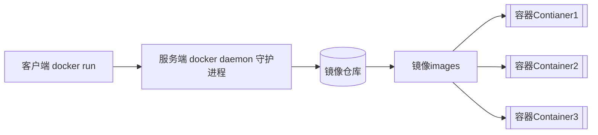
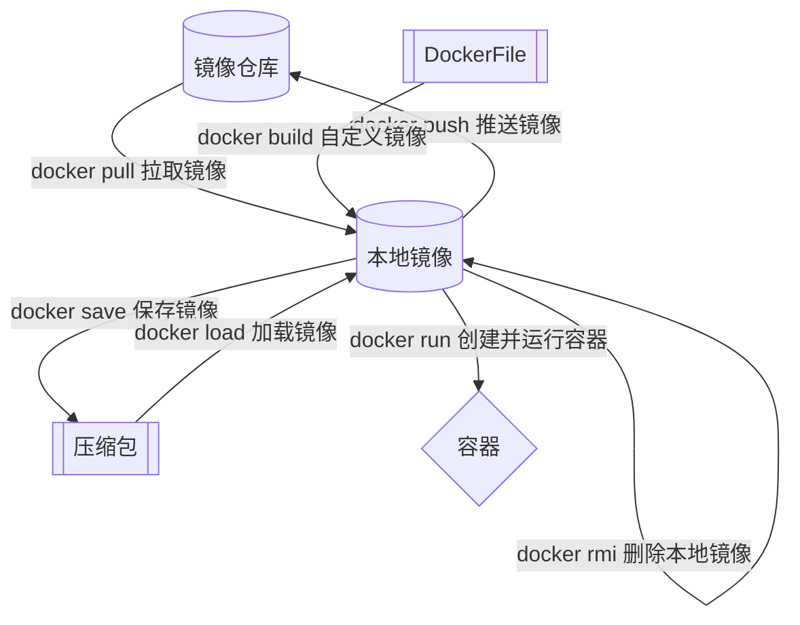
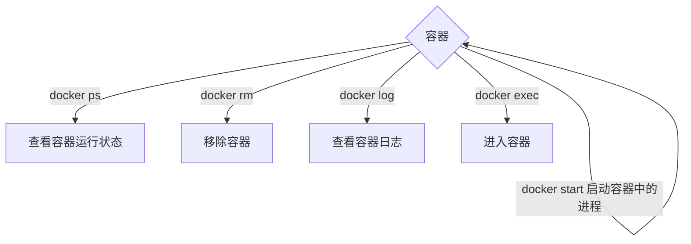
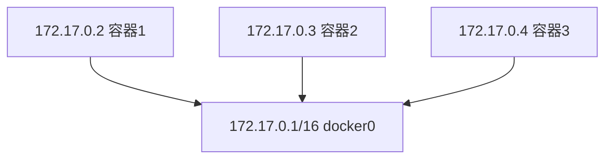

# Docker 

跨平台快速运行应用

可以快速对项目进行打包

快速分享应用

当软件包发布到DockerHub上后[DockerHub (docker.com)](http://hub.docker.com/)，我们称这个软件包为镜像（需翻墙）


## Docker 原理

Docker-cli -> Docker主机 -> Registry（应用市场）

### 镜像和容器

当我们利用Docker安装应用的时候，Docker会自动搜索并下载应用镜像（image）。镜像本身不仅包含应用本身，还包含应用运行所需要的环境、配置、系统函数库。

Docker会在运行镜像时创建一个隔离环境，称为容器（container）

镜像仓库：存储和管理镜像的平台，Docker官方维护了一个公共仓库：Docker Hub




## Docker 安装（Linux）

[如何在 Ubuntu 22.04 LTS 中安装 Docker 和 Docker Compose-如何在ubuntu上安装docker (51cto.com)](https://www.51cto.com/article/715086.html)

[容器镜像服务 (aliyun.com)](https://cr.console.aliyun.com/cn-hangzhou/instances/mirrors)

1. 更新Ubuntu系统与添加Docker库

   1. ```bash
      $ sudo apt update
      $ sudo apt upgrade
      $ sudo apt full-upgrade
      
      # 安装必要的证书并允许 apt 包管理器使用以下命令通过 HTTPS 使用存储库
      $ sudo apt install apt-transport-https ca-certificates curl software-properties-common gnupg lsb-release
      ```

   2. ```bash
      #  添加 Docker 的官方 GPG 密钥
      $ curl -fsSL https://download.docker.com/linux/ubuntu/gpg | sudo gpg --dearmor -o /usr/share/keyrings/docker-archive-keyring.gpg
      # 添加 Docker 的阿里云 GPG 秘钥 二选一 建议阿里 因为官方的八成用不了
   $ curl -fsSL http://mirrors.aliyun.com/docker-ce/linux/ubuntu/gpg | sudo apt-key add -
      ```
      
   3. ```bash
      # 添加 Docker 官方库
      $ echo "deb [arch=$(dpkg --print-architecture) signed-by=/usr/share/keyrings/docker-archive-keyring.gpg] https://download.docker.com/linux/ubuntu $(lsb_release -cs) stable" | sudo tee /etc/apt/sources.list.d/docker.list > /dev/null
      # 添加 Docker 阿里云库 二选一 建议阿里 因为官方的八成用不了
   sudo add-apt-repository "deb [arch=amd64] http://mirrors.aliyun.com/docker-ce/linux/ubuntu $(lsb_release -cs) stable"
      ```
      
   4. ```bash
      # 更新 Ubuntu 源列表
      $ sudo apt update
      ```

3. #### 安装 Docker

   1. ```bash
      # 安装最新CE
      $ sudo apt install docker-ce docker-ce-cli containerd.io docker-compose-plugin
      ```

   2. ```bash
      # 非必须 安装其他Docker版本
      $ apt-cache madison docker-ce
      # 输出示例：
      docker-ce | 5:20.10.17~3-0~ubuntu-jammy | https://download.docker.com/linux/ubuntu jammy/stable amd64 Packages
          docker-ce | 5:20.10.16~3-0~ubuntu-jammy | https://download.docker.com/linux/ubuntu jammy/stable amd64 Packages
          docker-ce | 5:20.10.15~3-0~ubuntu-jammy | https://download.docker.com/linux/ubuntu jammy/stable amd64 Packages
          docker-ce | 5:20.10.14~3-0~ubuntu-jammy | https://download.docker.com/linux/ubuntu jammy/stable amd64 Packages
          docker-ce | 5:20.10.13~3-0~ubuntu-jammy | https://download.docker.com/linux/ubuntu jammy/stable amd64 Packages
      ```

   3. ```bash
      # 非必须 可以挑选上面列表中的任何版本进行安装。例如，安装 5:20.10.16~ 3-0 ~ubuntu-jammy 这个版本，运行：
      $ sudo apt install docker-ce=5:20.10.16~3-0~ubuntu-jammy docker-ce-cli=5:20.10.16~3-0~ubuntu-jammy containerd.io
      ```

   4. ```bash
      # 查看Docker版本
      $ docker -v
      # 查看Docker服务运行状态
      $ systemctl status docker
      ```

   5. 


## Docker 安装（Windows11）

直接安装 Docker Desktop 简单省事


## Docker安装后配置镜像加速器

### Ubuntu 配置镜像加速器
#### 安装／升级Docker客户端

推荐安装1.10.0以上版本的Docker客户端，参考文档[docker-ce](https://yq.aliyun.com/articles/110806)

#### 配置镜像加速器

针对Docker客户端版本大于 1.10.0 的用户

您可以通过修改daemon配置文件/etc/docker/daemon.json来使用加速器

```bash
sudo mkdir -p /etc/docker
sudo tee /etc/docker/daemon.json <<-'EOF'
{
  "registry-mirrors": ["https://0vp10bmq.mirror.aliyuncs.com"]
}
EOF
sudo systemctl daemon-reload
sudo systemctl restart docker
```


### Windows

#### 安装／升级Docker客户端

对于Windows 10以下的用户，推荐使用Docker Toolbox

Windows安装文件：http://mirrors.aliyun.com/docker-toolbox/windows/docker-toolbox/

对于Windows 10以上的用户 推荐使用Docker for Windows

Windows安装文件：http://mirrors.aliyun.com/docker-toolbox/windows/docker-for-windows/

#### 配置镜像加速器

针对安装了Docker Toolbox的用户，您可以参考以下配置步骤：

创建一台安装有Docker环境的Linux虚拟机，指定机器名称为default，同时配置Docker加速器地址。

```bash
docker-machine create --engine-registry-mirror=https://0vp10bmq.mirror.aliyuncs.com -d virtualbox default
```

查看机器的环境配置，并配置到本地，并通过Docker客户端访问Docker服务。

```bash
docker-machine env defaulteval "$(docker-machine env default)"docker info
```

针对安装了Docker for Windows的用户，您可以参考以下配置步骤：

在系统右下角托盘图标内右键菜单选择 Settings，打开配置窗口后左侧导航菜单选择 Docker Daemon。编辑窗口内的JSON串，填写下方加速器地址：

```json
{
  "registry-mirrors": ["https://0vp10bmq.mirror.aliyuncs.com"]
}
```

编辑完成后点击 Apply 保存按钮，等待Docker重启并应用配置的镜像加速器。

#### 注意

Docker for Windows 和 Docker Toolbox互不兼容，如果同时安装两者的话，需要使用hyperv的参数启动。

```bash
docker-machine create --engine-registry-mirror=https://0vp10bmq.mirror.aliyuncs.com -d hyperv default
```

Docker for Windows 有两种运行模式，一种运行Windows相关容器，一种运行传统的Linux容器。同一时间只能选择一种模式运行。


## Docker安装软件

### 授予用户Docker组权限

```bash
# docker 免sudo
sudo groupadd docker
sudo gpasswd -a ${USER} docker
sudo service docker restart
newgrp - docker
```


### 部署Mysql （Linux）

首先停止虚拟机中的MySql，确保虚拟机已经安装Docker，并且开通网络的情况下，执行下列命令( \ 换行)

```bash
docker run -d \
	--name mysql \
	-p 3306:3306 \
	-e TZ=Asia/Shanghai \
	-e MYSQL_ROOT_PASSWORD =123456 \
mysql
```

#### 命令解读

- Docker run 创建并运行一个容器， -d是让容器在后台运行
- --name mysql：给容器起名字，必须唯一
- -p 3306 : 3306：设置端口映射
- -e KEY = VALUE：设置环境变量
- mysql ： 指定运行镜像的名字（非完全）完全格式：[respository]:[tag] -> mysql:5.7


## Docker 命令

Docker 最常见的命令就是操作镜像、容器的命令，详见官网文档：https://docs.docker.com





语法 1 ：docker [参数] [选项1] [值1] [选项2] [值2] ... 

语法 2 ：docker [参数]

...

### 命令别名

当觉得命令太长了的时候可以设置命令别名，进入.bashrc配置文件中

```bash
# 进入bashrc配置文件中
vi ~/.bashrc
```

```basic
# 自定义dps命令为docker ps
alias dps='docker ps --format "table {{{.ID}}\t{{.Image}}\t{{.Ports}}\t{{.Status}}\t{{.Names}}" '
```

```bash
# 修改完毕后要使其生效
source /root/.bashrc
```


### 常用命令

| 命令                               | 参数                       | 作用                                                         | 示例                                                         |
| ---------------------------------- | -------------------------- | ------------------------------------------------------------ | ------------------------------------------------------------ |
| docker run                         | -d<br/>--name<br/>-p<br>-e | 创建一个Docker容器(-e是开发者设置的Docker环境变量参数，不同情况下需要的键值对不同) | docker run -d --name mysql -p 3306:3306 -e TZ=Asia/Shanghai -e MYSQL_ROOT_PASSWORD =123456 mysql |
| docker inspect                     | [容器名]                   | 查看容器                                                     | docker inspect mysql                                         |
| docker ps                          | --format<br/>-a            | 查看容器信息<br>--format可以设置选项对其进行格式化输出信息<br>-a可以查看所有运行中容器（加在最后） | docker ps --format "{{.ID}}\t{{.Image}}\t{{.Ports}}\t{{.Status}}\t{{.Names}}" -a |
| docker logs [容器名] [选项]        | -f                         | 查看容器日志<br/>-f 持续输出日志                             |                                                              |
| docker exec [选项] [容器名] [命令] | -it                        | 进入容器<br/>命令通常为bash，意味着进入该容器的终端控制台，也可以输入容器内软件的命令，如mysql |                                                              |
| exit                               |                            | 退出容器                                                     |                                                              |


## Docker 存储

### Docker 数据卷

数据卷（Volume）是一个虚拟目录。是容器内目录与宿主机目录之间映射的桥梁。

案例：

创建Nginx容器，修改nginx容器内的html目录下的index.html文件，查看变化

将静态资源部署到Nginx的html目录


当创建了一个数据卷，他会放在宿主机下的一个固定目录下

```bash
/var/lib/docker/volumes/html/_data
/var/lib/docker/volumes/config/_data
...
/var/lib/docker/volumes/数据卷N/_dataN
```

我们需要让那个容器的某个目录下对宿主机目录下进行挂载

当挂载成了，此时Docker会自动对齐进行双向绑定。

| 命令                  | 说明                 | 文档地址 |
| --------------------- | -------------------- | -------- |
| docker volume create  | 创建数据卷           |          |
| docker volume ls      | 查看所有数据卷       |          |
| docker volume rm      | 删除指定数据卷       |          |
| docker volume inspect | 查看某个数据卷的详情 |          |
| docker volume prune   | 清楚数据卷           |          |

Tip：在执行Docker run 命令时，使用-v 数据卷：容器内目录 可以完成数据卷挂载。创建容器时，如果挂载了数据卷且数据卷不存在，会自动创建数据卷。

**但是已经创建的容器是无法挂载数据卷的**


## Docker 自定义镜像

镜像就是包含了应用程序程序运行的系统函数库、运行配置等文件的文件包。构建镜像的过程其实就是把上述文件打包的过程。

```bash
# 部署一个Java应用的步骤
1. 准备一个Linux服务器
2. 安装JRE并配置环境变量
3. 拷贝jar包
4. 运行jar包
```

```bash
# 部署一个Java镜像的步骤
1. 准备一个Linux运行环境
2. 安装JRE并配置环境变量
3. 拷贝jar包
4. 编写运行脚本
```

### 入口 Entrypoint

镜像运行入口，一般是程序启动的脚本和参数


### 层 Layer

添加安装包、依赖、配置等，每次操作都会形成新的一层


### 基础镜像 BaseImage

应用依赖的系统函数库、环境、配置、文件等


## Docker  File

Docker File就是一个文本文件，其中包含一个个的指令，用指令来说明要执行什么操作来构建镜像。将来Docker可以根据Dockerfile帮我构建镜像。常见指令如下

| 常用指令   | 说明                                         | 示例                                                         |
| ---------- | -------------------------------------------- | ------------------------------------------------------------ |
| FROM       | 指定基础镜像                                 | FROM centos:6                                                |
| ENV        | 设置环境变量，可在后面指令使用               | ENV key value                                                |
| COPY       | 拷贝本地文件到镜像的指定目录                 | COPY ./jre11.tar.gz /tmp                                     |
| RUN        | 执行Linux的Shell命令，一般是安装过程的命令   | RUN tar -zxvf /tmp/jre11.tar.gz && EXPORTS path=/tmp/jre11:$path |
| EXPOSE     | 指定容器运行时监听的端口，是给镜像使用者看的 | EXPOSE 8080                                                  |
| ENTRYPOINT | 镜像中应用的启动命令，容器运行时调用         | ENTRYPOINT java -jar xx.jar                                  |

更多详细部分可以查看文档：https://docs.docker.com/engine/reference/builder

案例：我们可以基于Ubuntu基础镜像，利用Dockerfile描述镜像结构，也可以直接基于JDK为基础镜像，省略前面的步骤

```dockerfile
# 基础镜像
FROM openjdk:11.0-jre-buster
# 配置时区
ENV TZ=Asia/Shanghai
# 拷贝jar包
COPY docekr-demo.jar /app.jar
# 入口
ENTRYPOINT ["java","-jar","/app.jar"]
```

当编写好了Dockerfile，可以利用下面命令来构建镜像

```bash
docker build -t 镜像名称:镜像版本
```

-t 是给镜像起名字，格式依然是repository:tag的格式，不指定tag时，默认是latest

.:是指定Dockerfile所在目录，如果就在当前目录，则指定为"."


## Docker 网络

默认情况下，所有容器都是以bridge桥接方式连接到Docker的虚拟网桥上。



自定义网络

加入自定义网络的容器才可以通过容器名互相访问，Docker网络操作命令如下：

| 命令                      | 说明                     | 文档地址 |
| ------------------------- | ------------------------ | -------- |
| docker network create     | 创建一个网络             |          |
| Docker network ls         | 查看所有网络             |          |
| Docker network rm         | 删除指定网络             |          |
| docker network prune      | 清楚未使用的网络         |          |
| docker network connect    | 使指定容器链接加入某网络 |          |
| docker network disconnect | 使指定容器连接离开某网络 |          |
| docker network inspect    | 查看网络详细信息         |          |


## Docker  Compose


### Ubuntu22.04安装

安装Docker
更新软件包，执行1、2
安装最新版本的Docker CE（社区版），执行3
验证Docker安装成功：Docker成功运行并显示“Hello from Docker!”，执行4
xshell执行：

```bash
sudo apt update  #1
sudo apt upgrade #2
sudo apt install docker-ce docker-ce-cli containerd.io #3
sudo docker run hello-world #4
```


安装Docker-compose

点击https://github.com/docker/compose/releases/，找到与自己系统适配的版本。本文为Ubuntu22.04对应版本
点击Assets，找到docker-compose-linux-x86_64点击下载
xftp上传到服务器自己的文件夹中，执行1
为二进制文件添加执行权限，执行2
验证Docker Compose是否已正确安装并查看其版本号，执行3
我是下载到本地文件夹，之后用xftp上传到指定文件夹中，之后使用sudo命令移动到/usr/local/bin目录下。用网络直接在服务器上下载太太太慢了，还出现了下载中断的现象，白费时间，有的镜像网站也是有点问题

xshell执行：

```bash
sudo mv docker-compose-linux-x86_64 /usr/local/bin/docker-compose #1
sudo chmod +x /usr/local/bin/docker-compose #2
docker-compose --version #3
```


Docker Compose 通过一个单独的docker-compose.yml模板文件（YAML格式）来定义一组相关联的应用容器，帮助我们实现多个相互关联的Docker容器的快速部署。

```yml
# 例子
version: "3.8"
services:
	mysql: mysql
	container_name: mysql
	ports:
		- "3306:3306"
    environment:
    	TZ: Asia/Shangahai
    	MYSQL_ROOT_PASSWORD: 123456
   volumes:
   		"./mysql/conf:/etc/mysql/conf.d"
   		"./mysql/data:/var/lib/mysql"
   		"./mysql/init/docker-entrypoint-initdb.d"
   	networks:
   		- hmall
```


Docker compose 的命令格式如下

```bash
docker compose [Option] [command]
```

| 类型     | 参数或者指令 | 说明                        |
| -------- | ------------ | --------------------------- |
| Options  | -f           | 指定Compose文件的路径和名称 |
|          | -p           | 指定Project名称             |
| Commands | up           | 创建并启动所有的service容器 |
|          | down         | 停止并移除所有容器、网络    |
|          | ps           | 列出所有启动的容器          |
|          | logs         | 查看指定容器的日志          |
|          | stop         | 停止容器                    |
|          | start        | 启动容器                    |
|          | restart      | 重启容器                    |
|          | top          | 查看运行中的进程            |
|          | exec         | 在指定的运行容器中执行命令  |


## Docker 部署案例

[Java——Linux使用Docker部署若依前后端分离版【保姆级教程】_若依 docker部署-CSDN博客](https://blog.csdn.net/Pan_peter/article/details/128807946)

### MySQL 部署

部署后需要在容器中进行设置

```mysql
mysql -u root -p

use mysql;

update user set host = '%' where user = 'root';

ALTER USER 'root'@'%' IDENTIFIED WITH mysql_native_password BY 'root';

select user,host,plugin from user;

flush privileges;
```


### Tomcat 部署


### 若依项目部署

```bash
sudo docker pull openjdk:17
docker pull mysql:8.0.19
docker pull redis
docker pull nginx
docker pull node
```

docker cp /data/applications/nginx/html* nginx:/usr/share/nginx/html/

#### 前端

- 修改.env.production文件中的配置
- 
- 修改src/router/index.js，设置mode属性为hash
- 
- 执行bin\build.bat进行打包

### Java项目部署

1. JavaSpring项目中，设置applicantion.yml文件，数据库连接地址最好不要设死

   1. ```yml
      # 读取配置中的其他配置变量
      spring:
      	datasource: jdbc:mysql://${hm.db.host}:3306
      	username: root
      	password: ${hm.db.pw}
      ```

   2. ```yml
      # yml 配置文件
      hm:
      	db:
      		# 修改为虚拟机IP地址
      		host: 192.168.150.101 
      		# 修改为Docker中的Mysql密码
      		pw: 123 
      ```

2. 在SpringBoot右侧面Maven面板选择Lifecycle中的package打包选项

3. ......

```dockerfile
docker run -d \
-p 2077:2077 \
-p 444:443 \
--name manage-nginx \
--restart=always \
-e TZ="Asia/Shanghai" \
-v /data/applications/nginx/conf/nginx.conf:/etc/nginx/nginx.conf \
-v /data/applications/nginx/conf/conf.d:/etc/nginx/conf.d \
-v /data/logs/nginx:/var/log/nginx \
-v /data/applications/nginx/html:/usr/share/nginx/html \
-v /data/applications/nginx/cert:/etc/nginx/cert \
nginx
```

```

docker run -d \
-p 80:80 \
-p 443:443 \
--name uniapp-nginx \
--restart=always \
-e TZ="Asia/Shanghai" \
-v /data/applications/nginx-uniapp/conf/nginx.conf:/etc/nginx/nginx.conf \
-v /data/applications/nginx-uniapp/conf/conf.d:/etc/nginx/conf.d \
-v /data/logs/nginx-uniapp:/var/log/nginx \
-v /data/applications/nginx-uniapp/html:/usr/share/nginx/html \
-v /data/applications/nginx-uniapp/cert:/etc/nginx/cert \
nginx
```

